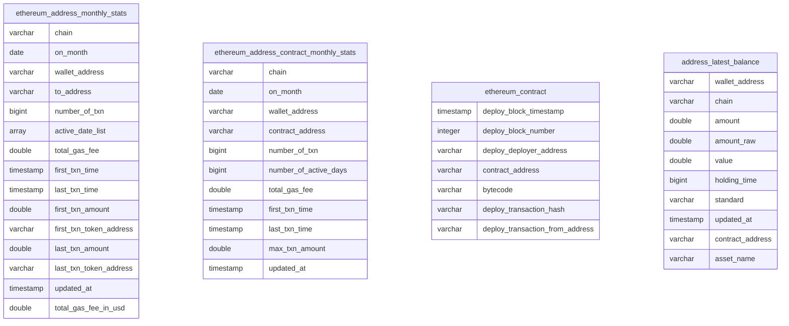

## Data Overview 

### Data Relationship




## Address Analysis Scenarios

### Address holds assets

- By analyzing the data on address_latest_balance, we can see the latest asset status of each address on each chain. From the data, we can see the asset proportion of nft and token
```sql
with 
wallet_balance as (
    select 
    (case when standard in ('ERC1155','ERC721') then 'NFT'  when standard in('ERC20','NativeToken',null ,'') then 'Tokens' else '*Total' end) AS asset_type
    ,count(distinct contract_address) as "count"
    ,sum("value") AS "total_value"
    ,cast(sum("value") as double)/cast((select sum(value) from ud_address_a_group_latest_balance_2023_09_01 [[where wallet_address={{wallet_address}}]] ) as double ) as pnt
    from  address_latest_balance
    where 1=1
     and standard is not null
    and  wallet_address='0x8b5b9a7a17bc143913f29dd40a07f0b2962653f7'
    group by rollup(standard)
    order by 3 desc
)
select 
asset_type
,sum("count") as count
,sum(total_value) as total_value
,sum(pnt) as pnt
from wallet_balance
where pnt is not null
and total_value >0
group by 1 
order by 3 desc
```
#### Analyze user address interactions
- By analyzing the data on ethereum_address_monthly_stats, we can see the data that 0x8b5b9a7a17bc143913f29dd40a07f0b2962653f7 address is interacting with. From the data, you can see how many platforms the address interacts with, the number of interactive transactions and the gas fees consumed.
 ```sql
with protocol as (
        select 
            distinct coalesce(protocol_name,ci.protocol_slug) as protocol_name,contract_address,pi.chain,logo
            from 
        protocol_info pi
           inner join 
        contract_info  ci
        on pi.protocol_slug = ci.protocol_slug and pi.chain =ci.chain
        where pi.chain ='Ethereum'
)
select 
--   protocol_name
--  ,max(logo) as logo
 sum(number_of_txn) as "Transactions"
 ,sum(total_gas_fee_spent_in_usd) as "Transaction Fees"
 ,sum(total_gas_fee_spent) as "Transaction Fees (ETH)"
 ,count(distinct protocol_name) as "Interact Projects"
from 
    ethereum_address_monthly_stats ie
    left join 
    protocol  ci
    on ie.to_address = ci.contract_address
    where wallet_address ='0x8b5b9a7a17bc143913f29dd40a07f0b2962653f7'
```

#### The top ten rankings of dapps (contracts) with the most gas consumption by addresses
```sql
select
chain
, wallet_address
, contract_address
, total_gas_fee_spent_in_usd
from ethereum_address_contract_latest_stats
where wallet_address=lower('0x8b5b9a7a17bc143913f29dd40a07f0b2962653f7')
order by total_gas_fee_spent_in_usd desc
limit 10

```

#### Number of contracts created per day
```sql
 select 
  date_trunc('day',deploy_block_timestamp) as depoly_date
    ,count(distinct deployed_contracts.contract_address) as Contracts
    ,sum(count(distinct deployed_contracts.contract_address)) over (order by date_trunc('day',deploy_block_timestamp)) as "Total Contracts"
from "deployed_contracts"
where deployed_contracts.chain='Ethereum'
group by 1
```
