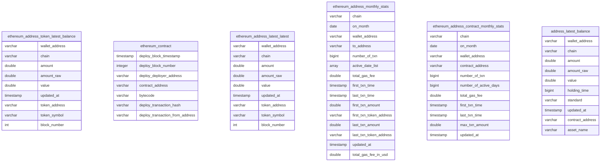

## Data Overview 

### Data Relationship



## Address Analysis Scenarios

The table `{{chain}}_address_token_latest_balance` is a record of token quantities and values held by addresses on the {{chain}} blockchain. It consists of the following columns:

- `wallet_address`: The address associated with the token holdings.
- `chain`: The blockchain network where the tokens reside (e.g., Ethereum, Polygon, etc.).
- `amount`: The amount of tokens held by the address.
- `amount_raw`: The raw value of the token balance.
- `value`: The estimated value of the tokens based on the current market price.
- `updated_at`: The timestamp of the last update to the token balance.
- `token_address`: The address of the token contract.
- `token_symbol`: The symbol or abbreviation representing the specific token.
- `block_number`: The block number when the token balance was updated.

By analyzing the `{{chain}}_address_token_latest_balance` table, you can extract information about the token holdings of specific addresses on the given blockchain. The table provides detailed information, including the address, blockchain network, token quantity, raw balance, estimated value, last updated timestamp, token contract address, and token symbol.For example, if you want to retrieve the token holdings of the address '0x176F3DAb24a159341c0509bB36B833E7fdd0a132' owned by Sun Yuchen (Sun Brother) on Ethereum, you can use SQL with the following query:
```sql
        SELECT token_symbol, amount, value
        FROM ethereum_address_token_latest_balance
        WHERE wallet_address = lower('0x176F3DAb24a159341c0509bB36B833E7fdd0a132')
```

The table `{{chain}}_nft_token_latest_balance` contains records of the latest balances for non-fungible tokens (NFTs) held by addresses on the {{chain}} blockchain. It includes the following columns:

- `wallet_address`: A unique identifier representing an address on the blockchain.
- `chain`: Indicates the specific blockchain network where the NFT balances are recorded (e.g., Ethereum, Polygon, etc.).
- `collection_name`: Represents the name or title of the NFT collection.
- `amount`: Represents the quantity of NFTs held by the wallet address in the specified collection.
- `value`: Represents the estimated value of the NFTs held by the wallet address in the specified collection.
- `holding_time`: Represents the duration of time in which the wallet address has held the NFTs in the specified collection.
- `collection_contract_address`: Represents the address of the smart contract that governs the specified NFT collection.
- `nft_token_id`: Represents the unique identifier of a specific NFT token within the collection.
- `standard`: Represents the standard or protocol followed by the NFT collection (e.g., ERC-721, ERC-1155, etc.).
- `updated_at`: Represents the timestamp indicating when the NFT balance record was last updated.

To retrieve the information related to the NFT holdings of a specific wallet address '0x176F3DAb24a159341c0509bB36B833E7fdd0a132' (converted to lowercase) on the {{chain}} blockchain, you can use the following SQL example:

```sql
SELECT
    collection_name AS "Collection Name",
    amount AS "Amount",
    value AS "Value",
    holding_time AS "Holding Time",
    collection_contract_address AS "Collection Contract Address",
    nft_token_id AS "NFT Token ID",
    standard AS "Standard"
FROM {{chain}}_nft_token_latest_balance
WHERE wallet_address = lower('0x176f3dab24a159341c0509bb36b833e7fdd0a132')
```

"ethereum_contract" is a table that contains information about the creation of contracts on the Ethereum blockchain. It includes the following columns:

- `deploy_block_timestamp`: A timestamp indicating the time when the contract was deployed.
- `deploy_block_number`: An integer representing the block number at which the contract was deployed.
- `deploy_deployer_address`: The Ethereum address of the entity that deployed the contract.
- `contract_address`: The address assigned to the deployed contract.
- `bytecode`: The compiled bytecode of the contract.
- `deploy_transaction_hash`: The transaction hash associated with the contract deployment.
- `deploy_transaction_from_address`: The Ethereum address from which the deployment transaction was initiated.

This table provides valuable information about the deployment of contracts on the Ethereum blockchain, including timestamps, block numbers, deployer addresses, contract addresses, bytecode, and transaction details.
To query Number of contracts created per day,you can use the following SQL statement:

```sql
 select 
  date_trunc('day',deploy_block_timestamp) as depoly_date
    ,count(distinct deployed_contracts.contract_address) as Contracts
    ,sum(count(distinct deployed_contracts.contract_address)) over (order by date_trunc('day',deploy_block_timestamp)) as "Total Contracts"
from "deployed_contracts"
where deployed_contracts.chain='Ethereum'
group by 1
```

The table `{{chain}}_address_latest_stats` is a record of address behavior on the {{chain}} blockchain, which includes various statistics such as the total number of transactions, a list of active days, gas fees consumed, and other related information. The `{{chain}}` variable can represent different blockchain networks such as Ethereum, Polygon, and others. It includes the following columns:

- `chain`: Indicates the specific blockchain network where the addressed activities are recorded (e.g., Ethereum, Polygon, etc.).
- `wallet_address`: A unique identifier representing an address on the blockchain.
- `number_of_txn`: Represents the total number of transactions performed by the address.
- `active_date_list`: An array that stores the list of active days for the address.
- `total_gas_fee`: Represents the cumulative gas fees consumed by the address.
- `first_txn_time`: Represents the timestamp of the first transaction associated with the address.
- `first_txn_amount`: Represents the amount/value transacted in the first transaction.
- `first_txn_token_address`: Represents the address of the token contract involved in the first transaction.
- `last_txn_time`: Represents the timestamp of the most recent transaction associated with the address.
- `last_txn_amount`: Represents the amount/value transacted in the most recent transaction.
- `last_txn_token_address`: Represents the address of the token contract involved in the most recent transaction.
- `updated_at`: Represents the timestamp indicating when the statistics were last updated.
- `total_gas_fee_in_usd`: Represents the total gas fee expressed in USD based on the current market price.

To retrieve the gas fees consumed and the number of transactions associated with the address '0x176f3dab24a159341c0509bb36b833e7fdd0a132' owned by Sun Yuchen (Sun Brother), converted to lowercase, you can use the following SQL query:

```sql
SELECT total_gas_fee, number_of_txn
FROM ethereum_address_latest_stats
WHERE LOWER(wallet_address) = '0x176f3dab24a159341c0509bb36b833e7fdd0a132';
```


The table `{{chain}}_address_monthly_stats` contains summarized monthly behavior records for addresses on the {{chain}} blockchain. It includes the following columns:

- `chain`: Indicates the specific blockchain network where the address activities are recorded (e.g., Ethereum, Polygon, etc.).
- `on_month`: Represents the month for which the statistics are summarized.
- `wallet_address`: A unique identifier representing an address on the blockchain.
- `to_address`: Represents the address that received transactions from the wallet address during the specified month.
- `number_of_txn`: Represents the total number of transactions performed by the wallet address during the specified month.
- `active_date_list`: An array that stores the list of active days for the wallet address during the specified month.
- `total_gas_fee`: Represents the cumulative gas fees consumed by the wallet address during the specified month.
- `first_txn_time`: Represents the timestamp of the first transaction associated with the wallet address during the specified month.
- `last_txn_time`: Represents the timestamp of the most recent transaction associated with the wallet address during the specified month.
- `first_txn_amount`: Represents the amount/value transacted in the first transaction associated with the wallet address during the specified month.
- `first_txn_token_address`: Represents the address of the token contract involved in the first transaction associated with the wallet address during the specified month.
- `last_txn_amount`: Represents the amount/value transacted in the most recent transaction associated with the wallet address during the specified month.
- `last_txn_token_address`: Represents the address of the token contract involved in the most recent transaction associated with the wallet address during the specified month.
- `updated_at`: Represents the timestamp indicating when the statistics were last updated.
- `total_gas_fee_in_usd`: Represents the total gas fee expressed in USD based on the current market price for the transactions associated with the wallet address during the specified month.

To retrieve the information related to the address '0x176F3DAb24a159341c0509bB36B833E7fdd0a132' (converted to lowercase) belonging to Sun Yuchen (Sun Brother), such as the number of interactive transactions and the gas fees consumed, you can use the following SQL example:

```sql
WITH protocol AS (
    SELECT DISTINCT COALESCE(protocol_name, ci.protocol_slug) AS protocol_name, contract_address, pi.chain, logo
    FROM protocol_info pi
    INNER JOIN contract_info ci ON pi.protocol_slug = ci.protocol_slug AND pi.chain = ci.chain
    WHERE pi.chain = 'Ethereum'
)
SELECT 
    SUM(number_of_txn) AS "Transactions",
    SUM(total_gas_fee_spent_in_usd) AS "Transaction Fees",
    SUM(total_gas_fee_spent) AS "Transaction Fees (ETH)",
    COUNT(DISTINCT protocol_name) AS "Interact Projects"
FROM ethereum_address_monthly_stats ie
LEFT JOIN protocol ci ON ie.to_address = ci.contract_address
WHERE wallet_address = '0x176f3dab24a159341c0509bb36b833e7fdd0a132'
```


The table `{{chain}}_address_contract_monthly_stats` contains summarized monthly behavior records of address interactions with contracts on the {{chain}} blockchain. It includes the following columns:

- `chain`: Indicates the specific blockchain network where the address interactions with contracts are recorded (e.g., Ethereum, Polygon, etc.).
- `on_month`: Represents the month for which the statistics are summarized.
- `wallet_address`: A unique identifier representing an address on the blockchain.
- `contract_address`: Represents the address of the contract with which the wallet address interacted during the specified month.
- `number_of_txn`: Represents the total number of transactions performed by the wallet address with the specified contract during the specified month.
- `number_of_active_days`: Represents the number of active days during which the wallet address interacted with the specified contract during the specified month.
- `total_gas_fee`: Represents the cumulative gas fees consumed by the wallet address during its interactions with the specified contract during the specified month.
- `first_txn_time`: Represents the timestamp of the first transaction associated with the wallet address's interaction with the specified contract during the specified month.
- `last_txn_time`: Represents the timestamp of the most recent transaction associated with the wallet address's interaction with the specified contract during the specified month.
- `max_txn_amount`: Represents the maximum transaction amount/value involved in the wallet address's interactions with the specified contract during the specified month.
- `updated_at`: Represents the timestamp indicating when the statistics were last updated.

To retrieve the information related to the address '0x176F3DAb24a159341c0509bB36B833E7fdd0a132' (converted to lowercase) belonging to Sun Yuchen (Sun Brother) and its interaction with the Aave: Pool V3 contract at address '0x87870Bca3F3fD6335C3F4ce8392D69350B4fA4E2', you can use the following SQL example:

```sql
SELECT 
    number_of_txn AS "Total Transactions",
    number_of_active_days AS "Active Days",
    total_gas_fee AS "Total Gas Fee",
    first_txn_time AS "First Transaction Time",
    last_txn_time AS "Last Transaction Time",
    max_txn_amount AS "Maximum Transaction Amount"
FROM ethereum_address_contract_monthly_stats
WHERE wallet_address = lower('0x176f3dab24a159341c0509bb36b833e7fdd0a132') AND contract_address = lower('0x87870Bca3F3fD6335C3F4ce8392D69350B4fA4E2');
```

#### The top ten rankings of dapps (contracts) with the most gas consumption by addresses
```sql
select
chain
, wallet_address
, contract_address
, total_gas_fee_spent_in_usd
from ethereum_address_contract_latest_stats
where wallet_address=lower('0x8b5b9a7a17bc143913f29dd40a07f0b2962653f7')
order by total_gas_fee_spent_in_usd desc
limit 10

```


### Address holds assets

- By analyzing the data on address_latest_balance, we can see the latest asset status of each address on each chain. From the data, we can see the asset proportion of nft and token
```sql
with 
wallet_balance as (
    select 
    (case when standard in ('ERC1155','ERC721') then 'NFT'  when standard in('ERC20','NativeToken',null ,'') then 'Tokens' else '*Total' end) AS asset_type
    ,count(distinct contract_address) as "count"
    ,sum("value") AS "total_value"
    ,cast(sum("value") as double)/cast((select sum(value) from ud_address_a_group_latest_balance_2023_09_01 [[where wallet_address={{wallet_address}}]] ) as double ) as pnt
    from  address_latest_balance
    where 1=1
     and standard is not null
    and  wallet_address='0x8b5b9a7a17bc143913f29dd40a07f0b2962653f7'
    group by rollup(standard)
    order by 3 desc
)
select 
asset_type
,sum("count") as count
,sum(total_value) as total_value
,sum(pnt) as pnt
from wallet_balance
where pnt is not null
and total_value >0
group by 1 
order by 3 desc
```
