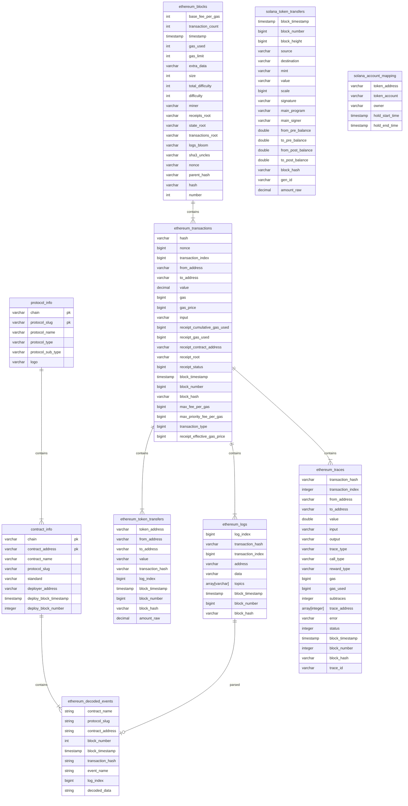

# Data Overview 

### Data Relationship




## Transactions Analysis Scenarios

### Concept

- **gas_price**: The gas price is the price per unit of gas that is set in a transaction. It represents the cost of each unit of gas required to execute the transaction. The gas price is set by the transaction initiator and can fluctuate in value due to changes in the price of Ether (ETH).
- **receipt_effective_gas_price**: The receipt effective gas price is the actual gas price calculated by the miner when they include the transaction in a block. After a transaction is confirmed, Ethereum generates a receipt that contains detailed information about the transaction, including the actual gas used and the receipt effective gas price. The receipt effective gas price is usually higher than the gas price set in the transaction because there may be competition among miners to include transactions in a block, and the actual gas used may exceed the estimated amount. In this case, the miner needs to recalculate the gas price.
- **receipt_gas_used**: The receipt gas used is the actual amount of gas consumed during the execution of a transaction. It is calculated by the Ethereum network based on the results of the transaction.
- **transaction_fee calculation formula**: `transaction_fee = receipt_effective_gas_price * receipt_gas_used`
- **amount_row** : erc20 token transfer amount (gwei unit)/nft token id of collection transfer

### Actual Average Transaction Fee

- By analyzing the data on ethereum_transactions, we can see the historical transaction fee situation. From the graph, we can observe a surge in transaction fees in November of year 22.

```sql
SELECT 
  DATE(block_timestamp) AS date,
  AVG(receipt_effective_gas_price) / 1e9 AS avg_gas_price,
  AVG(receipt_effective_gas_price * CAST( receipt_gas_used AS double )) / 1e18 AS avg_transaction_fee
FROM ethereum_transactions
WHERE block_timestamp >= current_timestamp - INTERVAL '30' DAY
GROUP BY DATE(block_timestamp)
ORDER BY DATE(block_timestamp) ASC
-- CAST(receipt_gas_used AS double) The result of multiplying two numbers is too large to be stored as a bigint, so it is converted to a double.
-- gas_price Gas prices are generally expressed in GWei. Here, unit conversion is performed ((receipt_effective_gas_price) / 1e9) and transaction fees are displayed in ether, which also requires conversion.
```

### Median Transaction Fee

- The average gas fee does not represent the transaction situation of ordinary users. Using the median is closer to the user experience. Due to the existence of many transaction bots on the chain, the average gas may be biased. By observing the statistics of this *median*, you can see the transaction situation at different times of each day. You can choose the timing of your transaction to save gas fees.

```sql
SELECT hour("block_timestamp") AS "hours",
(approx_percentile("gas_price", 0.5) * 1.0E-9) AS "median_gas_price", 
(avg("gas_price") * 1.0E-9) AS "avg_gas_price"
FROM ethereum_transactions
WHERE "block_timestamp" >= date(date_add('day', -30, now()))
GROUP BY hour("block_timestamp")
ORDER BY hour("block_timestamp") ASC
-- Compare the median and mean of the estimated transaction fees.
```

### USD-denominated Transaction Fee in the Last 90 Days

- While looking at gas fees, price is also an important factor because it reflects your actual expenditure. By combining with the *price table*, you can calculate the actual expenditure conveniently.

```sql
WITH fet AS (
  SELECT DATE(block_timestamp) AS on_date,
         AVG(receipt_effective_gas_price * CAST(receipt_gas_used AS double)) / 1e18 AS avg_gas_fee
  FROM ethereum_transactions
  WHERE block_timestamp >= current_timestamp - INTERVAL '90' DAY
  GROUP BY DATE(block_timestamp)
  ORDER BY DATE(block_timestamp) ASC
)
SELECT DATE(fet.on_date) AS on_date, SUM(tds.price * fet.avg_gas_fee) AS gas_fee_in_usd FROM fet
LEFT JOIN footprint.token_daily_stats AS tds
ON DATE(fet.on_date) = DATE(tds.on_date) AND tds.token_slug = 'ethereum-eth'
GROUP BY DATE(fet.on_date)
ORDER BY DATE(fet.on_date) ASC
-- Use the with clause to first query avg_gas_price, then join the price data to get the average price for the day
```


## Token Transfer Analysis Scenarios

### Token Transaction Volume 

- By analyzing token transfers, we can know the amount of tokens transferred each time. By combining with the token price, we can analyze the transaction situation of each token. Of course, we can also calculate other indicators, such as turnover rate, holding situation, the number of long-term holders, etc.

### SQL Analysis Methodology

#### Obtaining the recent price of a certain token

```sql
  SELECT 
    token_address, 
    timestamp, 
    price
  FROM token_price_5min
  WHERE token_address = lower('0x1f9840a85d5af5bf1d1762f925bdaddc4201f984')
  AND timestamp >= current_timestamp - INTERVAL '2' DAY
  AND chain = 'Ethereum'
-- use UNI token for example
```

#### query recent transaction history of a specific token

```sql
  SELECT 
    token_address, 
    block_timestamp, 
    from_address, 
    to_address, 
    transaction_hash,
    amount_raw / 1e18 as amount
  FROM ethereum_token_transfers
  WHERE token_address = lower('0x1f9840a85d5af5bf1d1762f925bdaddc4201f984')
    AND block_timestamp >= date_add('day', -2, current_date) and block_timestamp < current_date
```

#### Query the approximate price at the time of the transaction

```sql
WITH token_price_5min AS (
  SELECT 
    token_address, 
    timestamp, 
    price
  FROM token_price_5min
  WHERE token_address = lower('0x1f9840a85d5af5bf1d1762f925bdaddc4201f984')
  AND  timestamp >= date_add('day', -2, current_date) and timestamp < current_date
  AND chain = 'Ethereum'
)
SELECT 
  token_transfers.token_address, 
  token_transfers.block_timestamp, 
  token_transfers.from_address, 
  token_transfers.to_address, 
  token_transfers.transaction_hash,
  token_transfers.amount_raw / 1e18 as amount,
  amount_raw / 1e18 * t_price.price as value
FROM 
  ethereum_token_transfers AS token_transfers
LEFT JOIN 
  token_price_5min AS t_price
ON 
  token_transfers.token_address = t_price.token_address
  AND t_price.timestamp = from_unixtime(floor(to_unixtime(token_transfers.block_timestamp)/300) * 300)
WHERE token_transfers.block_timestamp >= date_add('day', -2, current_date) and timestamp < current_date
-- because the timestamps in the two tables are not aligned, we need to truncate the timestamps to the day level
-- floor(to_unixtime(token_transfers.block_timestamp)/300) We need to round down to the nearest 5 minutes to perform the join table
```

#### Calculate the hourly trading volume

```sql
WITH token_price_5min AS (
  SELECT 
    token_address, 
    timestamp, 
    price
  FROM token_price_5min
  WHERE token_address = lower('0x1f9840a85d5af5bf1d1762f925bdaddc4201f984') 
  AND  timestamp >= date_add('day', -2, current_date) and timestamp < current_date
  AND chain = 'Ethereum'
)
SELECT 
  date_format(block_timestamp, '%Y/%m/%d %H:00:00') as day,
  SUM(amount_raw / 1e18 * t_price.price) as volume
FROM 
  ethereum_token_transfers AS token_transfers
LEFT JOIN 
  token_price_5min AS t_price
ON 
  token_transfers.token_address = t_price.token_address
  AND t_price.timestamp = from_unixtime(floor(to_unixtime(token_transfers.block_timestamp)/300) * 300)
WHERE token_transfers.block_timestamp >= date_add('day', -2, current_date) and timestamp < current_date
GROUP BY 1
ORDER BY 1
```
## Solana chain Analysis Scenarios
### Query the Solana chain of each user's entry and exit of SOL tokens in the walken main account in the past 30 days
``` sql
SELECT 
    date("block_timestamp") AS "block_timestamp"
    , CASE WHEN "source" = 'STEPNq2UGeGSzCyGVr2nMQAzf8xuejwqebd84wcksCK' THEN "destination" ELSE "source" END AS "signer"
    , ( sum(CASE WHEN "destination" = 'STEPNq2UGeGSzCyGVr2nMQAzf8xuejwqebd84wcksCK' 
               THEN (CAST("amount_raw" AS double) / CASE WHEN power(10, "scale") = 0 
               THEN NULL ELSE power(10, "scale") END) ELSE 0.0 END
               ) - 
        sum(CASE WHEN "source" = 'STEPNq2UGeGSzCyGVr2nMQAzf8xuejwqebd84wcksCK' 
                 THEN (CAST("amount_raw" AS double) / CASE WHEN power(10, "scale") = 0 THEN NULL ELSE power(10, "scale") END) ELSE 0.0 END)
    ) AS "net_amount"
    ,sum(CASE WHEN "destination" = 'STEPNq2UGeGSzCyGVr2nMQAzf8xuejwqebd84wcksCK' 
               THEN (CAST("amount_raw" AS double) / CASE WHEN power(10, "scale") = 0 
               THEN NULL ELSE power(10, "scale") END) ELSE 0.0 END
               ) as in_amount
    ,sum(CASE WHEN "source" = 'STEPNq2UGeGSzCyGVr2nMQAzf8xuejwqebd84wcksCK' 
                 THEN (CAST("amount_raw" AS double) / CASE WHEN power(10, "scale") = 0 THEN NULL ELSE power(10, "scale") END) ELSE 0.0 END) as out_amount           
FROM "footprint"."solana_token_transfers"
WHERE ("mint" = 'sol'
   AND ("source" = 'STEPNq2UGeGSzCyGVr2nMQAzf8xuejwqebd84wcksCK' OR "destination" = 'STEPNq2UGeGSzCyGVr2nMQAzf8xuejwqebd84wcksCK') 
    AND "block_timestamp" >= date(date_add('day', -30, now())) 
    AND "block_timestamp" < date(date_add('day', 1, now())) 
    AND ("source" <> 'Ffbor3Zx46oGPK59S7drZjcTSt8mygZGWc5qkcHLPtWV' OR "source" IS NULL) 
    AND ("destination" <> 'Ffbor3Zx46oGPK59S7drZjcTSt8mygZGWc5qkcHLPtWV' OR "destination" IS NULL) 
    AND (CAST("amount_raw" AS double) / CASE WHEN power(10, "scale") = 0 THEN NULL ELSE power(10, "scale") END) > 0.02)
GROUP BY date("block_timestamp"),
(CASE WHEN "source" = 'STEPNq2UGeGSzCyGVr2nMQAzf8xuejwqebd84wcksCK' THEN "destination" ELSE "source" END)
ORDER BY date("block_timestamp") ASC, 
(CASE WHEN "source" = 'STEPNq2UGeGSzCyGVr2nMQAzf8xuejwqebd84wcksCK' THEN "destination" ELSE "source" END) ASC 
```
