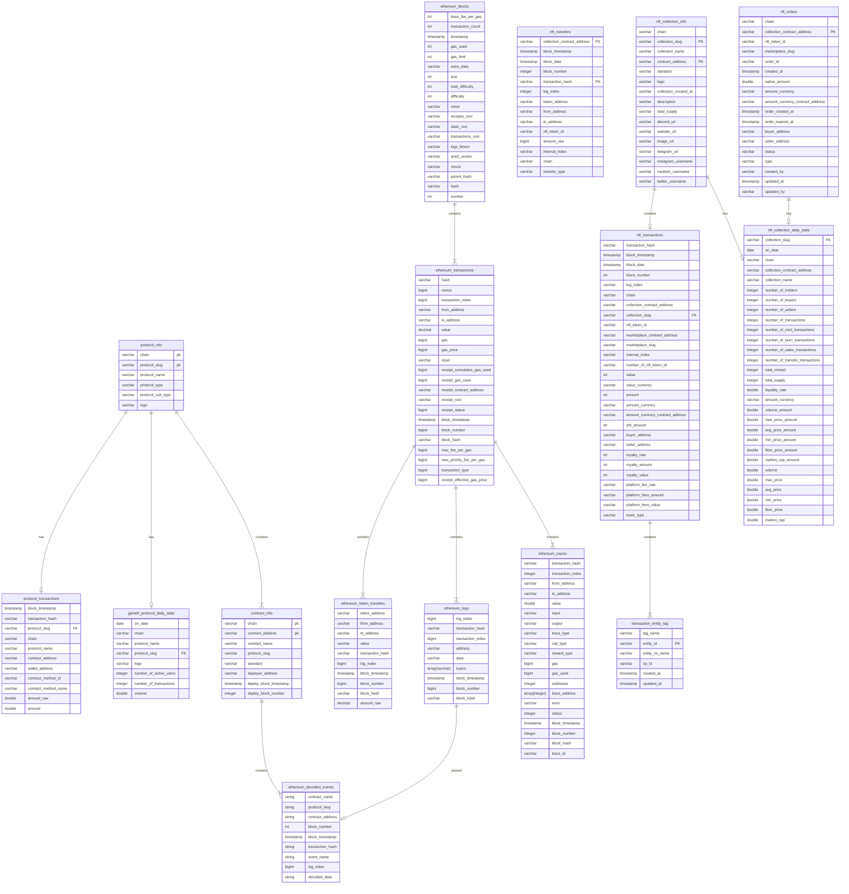

## Data Overview 

### Data Relationship




## Transactions Analysis Scenarios

### Concept

- **gas_price**: The gas price is the price per unit of gas that is set in a transaction. It represents the cost of each unit of gas required to execute the transaction. The gas price is set by the transaction initiator and can fluctuate in value due to changes in the price of Ether (ETH).
- **receipt_effective_gas_price**: The receipt effective gas price is the actual gas price calculated by the miner when they include the transaction in a block. After a transaction is confirmed, Ethereum generates a receipt that contains detailed information about the transaction, including the actual gas used and the receipt effective gas price. The receipt effective gas price is usually higher than the gas price set in the transaction because there may be competition among miners to include transactions in a block, and the actual gas used may exceed the estimated amount. In this case, the miner needs to recalculate the gas price.
- **receipt_gas_used**: The receipt gas used is the actual amount of gas consumed during the execution of a transaction. It is calculated by the Ethereum network based on the results of the transaction.
- **transaction_fee calculation formula**: `transaction_fee = receipt_effective_gas_price * receipt_gas_used`

### Actual Average Transaction Fee

- By analyzing the data on ethereum_transactions, we can see the historical transaction fee situation. From the graph, we can observe a surge in transaction fees in November of year 22.

```sql
SELECT 
  DATE(block_timestamp) AS date,
  AVG(receipt_effective_gas_price) / 1e9 AS avg_gas_price,
  AVG(receipt_effective_gas_price * CAST( receipt_gas_used AS double )) / 1e18 AS avg_transaction_fee
FROM ethereum_transactions
WHERE block_timestamp >= current_timestamp - INTERVAL '30' DAY
GROUP BY DATE(block_timestamp)
ORDER BY DATE(block_timestamp) ASC
-- CAST(receipt_gas_used AS double) The result of multiplying two numbers is too large to be stored as a bigint, so it is converted to a double.
-- gas_price Gas prices are generally expressed in GWei. Here, unit conversion is performed ((receipt_effective_gas_price) / 1e9) and transaction fees are displayed in ether, which also requires conversion.
```

### Median Transaction Fee

- The average gas fee does not represent the transaction situation of ordinary users. Using the median is closer to the user experience. Due to the existence of many transaction bots on the chain, the average gas may be biased. By observing the statistics of this *median*, you can see the transaction situation at different times of each day. You can choose the timing of your transaction to save gas fees.

```sql
SELECT hour("block_timestamp") AS "hours",
(approx_percentile("gas_price", 0.5) * 1.0E-9) AS "median_gas_price", 
(avg("gas_price") * 1.0E-9) AS "avg_gas_price"
FROM ethereum_transactions
WHERE "block_timestamp" >= date(date_add('day', -30, now()))
GROUP BY hour("block_timestamp")
ORDER BY hour("block_timestamp") ASC
-- Compare the median and mean of the estimated transaction fees.
```

### USD-denominated Transaction Fee in the Last 90 Days

- While looking at gas fees, price is also an important factor because it reflects your actual expenditure. By combining with the *price table*, you can calculate the actual expenditure conveniently.

```sql
WITH fet AS (
  SELECT DATE(block_timestamp) AS on_date,
         AVG(receipt_effective_gas_price * CAST(receipt_gas_used AS double)) / 1e18 AS avg_gas_fee
  FROM ethereum_transactions
  WHERE block_timestamp >= current_timestamp - INTERVAL '90' DAY
  GROUP BY DATE(block_timestamp)
  ORDER BY DATE(block_timestamp) ASC
)
SELECT DATE(fet.on_date) AS on_date, SUM(tds.price * fet.avg_gas_fee) AS gas_fee_in_usd FROM fet
LEFT JOIN footprint.token_daily_stats AS tds
ON DATE(fet.on_date) = DATE(tds.on_date) AND tds.token_slug = 'ethereum-eth'
GROUP BY DATE(fet.on_date)
ORDER BY DATE(fet.on_date) ASC
-- Use the with clause to first query avg_gas_price, then join the price data to get the average price for the day
```


## Token Transfer Analysis Scenarios

### Token Transaction Volume 

- By analyzing token transfers, we can know the amount of tokens transferred each time. By combining with the token price, we can analyze the transaction situation of each token. Of course, we can also calculate other indicators, such as turnover rate, holding situation, the number of long-term holders, etc.

### SQL Analysis Methodology

#### Obtaining the recent price of a certain token

```sql
  SELECT 
    token_address, 
    timestamp, 
    price
  FROM token_price_5min
  WHERE token_address = lower('0x1f9840a85d5af5bf1d1762f925bdaddc4201f984')
  AND timestamp >= current_timestamp - INTERVAL '2' DAY
  AND chain = 'Ethereum'
-- use UNI token for example
```

#### query recent transaction history of a specific token

```sql
  SELECT 
    token_address, 
    block_timestamp, 
    from_address, 
    to_address, 
    transaction_hash,
    amount_raw / 1e18 as amount
  FROM ethereum_token_transfers
  WHERE token_address = lower('0x1f9840a85d5af5bf1d1762f925bdaddc4201f984')
    AND block_timestamp >= date_add('day', -2, current_date) and block_timestamp < current_date
```

#### Query the approximate price at the time of the transaction

```sql
WITH token_price_5min AS (
  SELECT 
    token_address, 
    timestamp, 
    price
  FROM token_price_5min
  WHERE token_address = lower('0x1f9840a85d5af5bf1d1762f925bdaddc4201f984')
  AND  timestamp >= date_add('day', -2, current_date) and timestamp < current_date
  AND chain = 'Ethereum'
)
SELECT 
  token_transfers.token_address, 
  token_transfers.block_timestamp, 
  token_transfers.from_address, 
  token_transfers.to_address, 
  token_transfers.transaction_hash,
  token_transfers.amount_raw / 1e18 as amount,
  amount_raw / 1e18 * t_price.price as value
FROM 
  ethereum_token_transfers AS token_transfers
LEFT JOIN 
  token_price_5min AS t_price
ON 
  token_transfers.token_address = t_price.token_address
  AND t_price.timestamp = from_unixtime(floor(to_unixtime(token_transfers.block_timestamp)/300) * 300)
WHERE token_transfers.block_timestamp >= date_add('day', -2, current_date) and timestamp < current_date
-- because the timestamps in the two tables are not aligned, we need to truncate the timestamps to the day level
-- floor(to_unixtime(token_transfers.block_timestamp)/300) We need to round down to the nearest 5 minutes to perform the join table
```

#### Calculate the hourly trading volume

```sql
WITH token_price_5min AS (
  SELECT 
    token_address, 
    timestamp, 
    price
  FROM token_price_5min
  WHERE token_address = lower('0x1f9840a85d5af5bf1d1762f925bdaddc4201f984') 
  AND  timestamp >= date_add('day', -2, current_date) and timestamp < current_date
  AND chain = 'Ethereum'
)
SELECT 
  date_format(block_timestamp, '%Y/%m/%d %H:00:00') as day,
  SUM(amount_raw / 1e18 * t_price.price) as volume
FROM 
  ethereum_token_transfers AS token_transfers
LEFT JOIN 
  token_price_5min AS t_price
ON 
  token_transfers.token_address = t_price.token_address
  AND t_price.timestamp = from_unixtime(floor(to_unixtime(token_transfers.block_timestamp)/300) * 300)
WHERE token_transfers.block_timestamp >= date_add('day', -2, current_date) and timestamp < current_date
GROUP BY 1
ORDER BY 1
```


## NFT Analysis Scenarios

In footprint analytics , we index about 20 NFT marketplace, including opensea, rarible, foundation, blur, element, superrare, magic-eden, the-sandbox, aavegotchi, cryptopunks, etc.
We use collection_slug as a unique identifier for each NFT collection, and using marketplace_slug as a unique identifier for each NFT marketplace.
collection_slug to name some blue chip nft collection, such as cryptopunks, crypto-kitties, art-blocks, bored-ape-yacht-club, mocaverse , etc.


### query NFT marketplace Total Volume of using X2Y2  

```sql
SELECT date("nft_transactions"."block_timestamp") AS "block_timestamp", sum("nft_transactions"."amount") AS "sum"
FROM "nft_transactions"
WHERE lower("nft_transactions"."marketplace_slug") = 'x2y2'
GROUP BY date("nft_transactions"."block_timestamp")
ORDER BY date("nft_transactions"."block_timestamp") ASC
```

### query NFT marketplace Total trade count of using X2Y2  

```sql
SELECT date("nft_transactions"."block_timestamp") AS "block_timestamp", count(*) AS "count"
FROM "nft_transactions"
WHERE lower("nft_transactions"."marketplace_slug") = 'x2y2'
GROUP BY date("nft_transactions"."block_timestamp")
ORDER BY date("nft_transactions"."block_timestamp") ASC
```

### query NFT marketplace Daily Active User of using X2Y2  

```sql
with buyer_ad as(
SELECT 
seller_address  as  address,
date("nft_transactions"."block_timestamp") as date
FROM "nft_transactions"
where lower("marketplace_slug") = 'x2y2'
group by 1,2
),
seller_ad as (
SELECT 
buyer_address as address,
date("nft_transactions"."block_timestamp") as date
FROM "nft_transactions"
where lower("marketplace_slug") = 'x2y2'
group by 1,2
)
select count(distinct address) as address
from 
(
select * FROM
    buyer_ad
    union all 
 select * FROM
    seller_ad
)as a
```

###  washtrade analysis

Wash trading is the act of a trader buying and selling the same asset repeatedly to manipulate the trading volumes and/or the price of an asset. Parties involved may consist of a single entity or a collusion of entities. It is illegal in traditional capital markets to wash trade, as the intent is often to mislead other buyers/sellers that the asset is worth a lot more than it is, and/or that there is an artificially liquid market for the asset.
for more : https://coinmarketcap.com/community/articles/638ff563994fd743936035d7/ 


####  get NFT Washtrade Value Share by Marketplace

```sql
SELECT "nft_transactions"."marketplace_slug" AS "marketplace_slug", sum("nft_transactions"."value") AS "sum"
FROM "nft_transactions" INNER JOIN "transaction_entity_tag" "Transaction Entity Tag" ON "nft_transactions"."transaction_hash" = "Transaction Entity Tag"."entity_id"
GROUP BY "nft_transactions"."marketplace_slug"
ORDER BY "sum" DESC, "nft_transactions"."marketplace_slug" ASC
LIMIT 2000
```

#### query NFT Key Stats by Chain , including Washtrade

```sql
with buyers as(
    SELECT 
        chain,
        buyer_address as address
    FROM "nft_transactions"
    GROUP BY 1
    ,2
)
,sellers as (
    SELECT 
        chain,
        seller_address as address
    FROM "nft_transactions"
        GROUP BY 1
        ,2
),
total_users as (
 select
       count(distinct address) as total_tradersk,
       chain
  from 
        (
        select * from buyers
        union all 
        select * from sellers
        )a 
        GROUP by 2

)
,stats as (
    select 
        chain,
        sum(value) as total_sales_value,
        sum(case when entity_id is  null then 0 else value end)/sum(value) as washtrade_value_ratio,
        count(distinct buyer_address) / cast(count (distinct seller_address) as double) as "buyer/seller ratio",
        count(distinct seller_address) as sellers,
        count(distinct buyer_address)as buyers,
        count(distinct collection_slug) as total_collections
    from nft_transactions
    left join transaction_entity_tag
    on nft_transactions.transaction_hash = transaction_entity_tag.entity_id
    group by 1
    order by 2 desc 
)
  
select 
stats.chain,total_sales_value
,washtrade_value_ratio
,buyers 
,sellers
,"buyer/seller ratio"
,total_collections
from 
total_users
inner join 
stats
on total_users.chain = total_users.chain
group by 1,2,3,4,5,6,7
order by total_sales_value desc
```

### NFT collection analysis

####  get Total Mints of Mocaverse

```sql
SELECT sum("nft_transfers"."amount_raw") AS "sum"
FROM "nft_transfers"
LEFT JOIN "nft_collection_info" "nft_collection_info" ON ("nft_transfers"."collection_contract_address" = "nft_collection_info"."contract_address"
   AND "nft_transfers"."chain" = "nft_collection_info"."chain")
WHERE  "nft_transfers"."transfer_type" = 'mint' AND "nft_transfers"."collection_contract_address" = lower('0x59325733eb952a92e069c87f0a6168b29e80627f')  

```


#### Top 10 Ethereum NFT Projects Transactions 

```sql
select c.collection_name,
count(*) as transaction_count
from nft_transactions t
inner join nft_collection_info c on t.collection_contract_address = c.contract_address
where t.block_timestamp >= date_parse('2022-01-01', '%Y-%m-%d')
    and t.chain = 'Ethereum'
group by 1 
order by 2 desc
limit 10
```

#### query the daily Market Cap of the given collection contract address in last 90 days

```sql
SELECT "nft_collection_daily_stats"."on_date", sum("nft_collection_daily_stats"."market_cap") AS "market_cap"
FROM "nft_collection_daily_stats"
WHERE "nft_collection_daily_stats"."collection_contract_address" = lower('0x23581767a106ae21c074b2276d25e5c3e136a68b')
and "nft_collection_daily_stats"."on_date" >=date_add('day',-90,current_date)
GROUP BY 1
ORDER BY 1 ASC
LIMIT 2000
```

#### query the daily floor price of the given collection contract address in last 90 days

```sql
SELECT "nft_collection_daily_stats"."on_date", sum("nft_collection_daily_stats"."floor_price") AS "floor_price"
FROM "nft_collection_daily_stats"
WHERE "nft_collection_daily_stats"."collection_contract_address" = lower('0x23581767a106ae21c074b2276d25e5c3e136a68b')
and "nft_collection_daily_stats"."on_date" >=date_add('day',-90,current_date)
GROUP BY 1
ORDER BY 1 DESC
LIMIT 2000
```

#### To query nft holders, you need to take the nft_transfers table and transfer in and out of the corresponding collection according to each user. When the number of transfers minus the number of transfers is greater than 0, the user is considered to hold the nft of this collection, such as the following cryptopunks The holding user example
```sql
select 
    count(1) as holders
from 
(
select 
address,
sum(nfts) nfts
from 
(SELECT 
    to_address as address,
    sum(amount_raw) as nfts
    FROM "footprint"."nft_transfers"
WHERE 1=1
and collection_contract_address = lower('0xb47e3cd837ddf8e4c57f05d70ab865de6e193bbb')  -- 0xb47e3cd837ddf8e4c57f05d70ab865de6e193bbb  cryptopunks collection address
group by 1
union all 
SELECT 
    from_address as address,
    -sum(amount_raw) as nfts
    FROM "footprint"."nft_transfers"
WHERE 1=1
and collection_contract_address = lower('0xb47e3cd837ddf8e4c57f05d70ab865de6e193bbb')
group by 1
)a
group by 1
order by  2 desc
)
where nfts >0
```

#### query top 10 collections by Market Cap in last 90 days

```sql
SELECT "nft_collection_daily_stats"."collection_name" AS "collection_name", sum("nft_collection_daily_stats"."market_cap") AS "market_cap"
FROM "nft_collection_daily_stats"
WHERE ("nft_collection_daily_stats"."on_date" >= date_add('day', -90, current_date)
   AND "nft_collection_daily_stats"."on_date" < date(now()))
GROUP BY 1
ORDER BY 2 DESC, 1 ASC
LIMIT 10
```

#### query top 10 collections by volume in last 90 days

```sql
SELECT "nft_collection_daily_stats"."collection_name" AS "collection_name", sum("nft_collection_daily_stats"."volume") AS "volume"
FROM "nft_collection_daily_stats"
WHERE ("nft_collection_daily_stats"."on_date" >= date_add('day', -90, current_date)
   AND "nft_collection_daily_stats"."on_date" < date(now()))
GROUP BY 1
ORDER BY 2 DESC, 1 ASC
LIMIT 10
```

####  query the floor price of cryptopunks in last 90 days

```sql
SELECT date("nft_collection_daily_stats"."on_date") AS "on_date", "nft_collection_daily_stats"."collection_slug", sum("nft_collection_daily_stats"."floor_price") AS "floor_price"
FROM "nft_collection_daily_stats"
WHERE "nft_collection_daily_stats"."on_date" >= date_add('day', -90, current_date)
   AND "nft_collection_daily_stats"."on_date" < current_date 
AND "nft_collection_daily_stats"."collection_slug" = 'cryptopunks'
GROUP BY 1, 2
ORDER BY 1 DESC, 2 ASC
LIMIT 2000
```

#### query Daily Average Traded Price of benji-bananas-membership-pass in last 90 days

```sql
SELECT "nft_collection_daily_stats"."on_date",
         avg("nft_collection_daily_stats"."avg_price") AS "avg"
FROM "nft_collection_daily_stats" 
WHERE "nft_collection_daily_stats"."collection_slug" = 'benji-bananas-membership-pass'
        AND "nft_collection_daily_stats"."on_date" >= date_add('day', -90, current_date)
        AND "nft_collection_daily_stats"."on_date" < current_date
GROUP BY  1
ORDER BY  1 ASC LIMIT 2000
```


### Gamefi project analysis

if you want to query the daily active user count for GameFi protocols, you can use the gamefi_protocol_daily_stats table
gamefi_protocol_daily_stats table use protocol_slug as a unique identifier for each protocol.
some of the protocol_slug are listed below: alien-worlds ,splinterlands ,farmers-world ,sweat-wallet ,planet-ix ,upland ,walken ,secondlive ,sunflower-land ,nine-chronicles ,wombat-dungeon-master ,playmining ,axie-infinity ,arc8-by-gamee-1 ,iskra ,taco ,tiny-world ,meta-merge ,meta-apes ,mobox ,tap-fantasy ,genopets ,prospectors ,stepn ,benji-bananas ,carrom-blitz ,playbite ,laddercaster ,trickshot-blitz ,defi-kingdoms ,fancraze ,defi-kingdoms ,yuliverse ,burgercities ,monsterra ,niftykicks-factory ,oath-of-peak ,nft-panda-world-of-fantasy ,motodex ,xpansion ,castles-the-nft-game ,crazy-defense-heroes ,the-dustland ,solitaire-blitz ,meeet ,realm-nft ,hunters-on-chain ,playzap-games ,the-red-village ,ultiverse


#### query the daily active user count for planet-ix protocol

```sql
 select 
    on_date,
    number_of_active_users
    from 
gamefi_protocol_daily_stats
where  lower(protocol_slug) ='planet-ix'
group by 1
```

#### query the mothly new user count for planet-ix protocol

```sql
   select 
    date_trunc('month',on_date) as month,
    count(distinct wallet_address) as "New Users"
   from protocol_active_address 
    where protocol_type ='GameFi'
    and  lower(protocol_slug) ='planet-ix'
    and is_new_address = true
    group by 1
```

#### query the daily active user count for GameFi protocols

```sql
 select 
    on_date,
    number_of_active_users
    from 
gamefi_protocol_daily_stats
group by 1
```

#### query the mothly new user count for GameFi protocols

```sql
   select 
    date_trunc('month',on_date) as month,
    count(distinct wallet_address) as "New Users"
   from protocol_active_address 
    where protocol_type ='GameFi'
    and is_new_address = true
    group by 1
```

#### query the monthly active user count for GameFi protocols

```sql
        select 
    date_trunc('month',on_date) as month,
    count(distinct wallet_address) as "Active Users"
    from protocol_active_address 
    where protocol_type ='GameFi'
    group by 1
```

#### query the monthly active user count and Transactions for GameFi protocols

```sql
 select 
    date_trunc('month',on_date) as month,
    count(distinct wallet_address) as "Active Users",
   count(transaction_hash) as "Transactions"
  from protocol_transactions 
    where protocol_type ='GameFi'
    group by 1
```

#### query the monthly Volume and Transactions for GameFi protocols

```sql
select 
    date_trunc('month',on_date) as month,
    sum(volume) as volume,
    sum(number_of_transactions) as Transactions,
    from 
gamefi_protocol_daily_stats
group by 1
```

#### query Top GameFi Protocols by Active Users in the latest day

```sql
select 
    logo
    ,protocol_name
    ,chain
    ,number_of_active_users as "Active Users"
    ,volume as "Volume"
    ,number_of_transactions as "Transactions"
from gamefi_protocol_daily_stats
where on_date in( select max(on_date) from gamefi_protocol_daily_stats)
order by number_of_active_users desc
```


#### query Top GameFi Protocols by Total Volume

```sql
select 
    logo
    ,protocol_name
    ,chain
    ,sum(volume) as "Volume"
    ,sum(number_of_transactions) as "Transactions"
from gamefi_protocol_daily_stats
where on_date in( select max(on_date) from gamefi_protocol_daily_stats)
group by 1,2,3
order by 3 desc
```
