## Data Overview 

### Data Relationship

```mermaid
erDiagram
    protocol_info {
      varchar chain pk
      varchar protocol_slug pk
      varchar protocol_name
      varchar protocol_type
      varchar protocol_sub_type
      varchar logo
    }
    
    contract_info {
      varchar chain pk
      varchar contract_address pk
      varchar contract_name
      varchar protocol_slug
      varchar standard
      varchar deployer_address
      timestamp deploy_block_timestamp
      integer deploy_block_number
    }
    
    ethereum_blocks {
      int base_fee_per_gas
      int transaction_count
      timestamp timestamp
      int gas_used
      int gas_limit
      varchar extra_data
      int size
      int total_difficulty
      int difficulty
      varchar miner
      varchar receipts_root
      varchar state_root
      varchar transactions_root
      varchar logs_bloom
      varchar sha3_uncles
      varchar nonce
      varchar parent_hash
      varchar hash
      int number
    }

    ethereum_transactions {
      varchar hash
      bigint nonce
      bigint transaction_index
      varchar from_address
      varchar to_address
      decimal value
      bigint gas
      bigint gas_price
      varchar input
      bigint receipt_cumulative_gas_used
      bigint receipt_gas_used
      varchar receipt_contract_address
      varchar receipt_root
      bigint receipt_status
      timestamp block_timestamp
      bigint block_number
      varchar block_hash
      bigint max_fee_per_gas
      bigint max_priority_fee_per_gas
      bigint transaction_type
      bigint receipt_effective_gas_price
    }
    
    ethereum_token_transfers {
      varchar token_address
      varchar from_address
      varchar to_address
      varchar value
      varchar transaction_hash
      bigint log_index
      timestamp block_timestamp
      bigint block_number
      varchar block_hash
      decimal amount_raw
    }
    
    ethereum_logs {
      bigint log_index
      varchar transaction_hash
      bigint transaction_index
      varchar address
      varchar data
      array[varchar] topics
      timestamp block_timestamp
      bigint block_number
      varchar block_hash
    }
    
    ethereum_traces {
      varchar transaction_hash
      integer transaction_index
      varchar from_address
      varchar to_address
      double value
      varchar input
      varchar output
      varchar trace_type
      varchar call_type
      varchar reward_type
      bigint gas
      bigint gas_used
      integer subtraces
      array[integer] trace_address
      varchar error
      integer status
      timestamp block_timestamp
      integer block_number
      varchar block_hash
      varchar trace_id
    }

    ethereum_decoded_events {
      string contract_name
      string protocol_slug
      string contract_address
      int block_number
      timestamp block_timestamp
      string transaction_hash
      string event_name
      bigint log_index
      string decoded_data
    }
        nft_transfers {
        varchar collection_contract_address FK
        timestamp block_timestamp  
        timestamp block_date 
        integer block_number  
        varchar transaction_hash PK
        integer log_index  
        varchar token_address  
        varchar from_address 
        varchar to_address  
        varchar nft_token_id  
        bigint amount_raw  
        varchar internal_index  
        varchar  chain
        varchar transfer_type  
    }
    
    nft_collection_info {
        varchar chain
        varchar collection_slug PK
        varchar collection_name
        varchar contract_address PK
        varchar standard
        varchar logo
        varchar collection_created_at
        varchar description
      varchar total_supply
        varchar discord_url
        varchar website_url
        varchar image_url
      varchar telegram_url
        varchar instagram_username
        varchar medium_username
        varchar twitter_username
    }

    nft_transactions {
        varchar  transaction_hash
        timestamp  block_timestamp
        timestamp  block_date
        int  block_number
        varchar  log_index
        varchar  chain
        varchar  collection_contract_address
        varchar  collection_slug FK
        varchar  nft_token_id
        varchar  marketplace_contract_address
        varchar  marketplace_slug
        varchar  internal_index
        varchar  number_of_nft_token_id
        int  value 
        varchar  value_currency 
        int  amount
        varchar  amount_currency
        varchar  amount_currency_contract_address
        int  eth_amount
        varchar  buyer_address
        varchar  seller_address
        int  royalty_rate
        int  royalty_amount
        int  royalty_value
        varchar  platform_fee_rate
        varchar  platform_fees_amount
        varchar  platform_fees_value
        varchar  trade_type 
    }

    transaction_entity_tag {
        varchar tag_name
        varchar entity_id PK        
        varchar entity_ns_name
        varchar op_id
        timestamp created_at
        timestamp updated_at
    }


    gamefi_protocol_daily_stats {
        date on_date  
        varchar chain  
        varchar protocol_name  
        varchar protocol_slug  FK
        varchar logo  
        integer number_of_active_users  
        integer number_of_transactions  
        double volume 
    } 

    protocol_transactions { 
        timestamp block_timestamp  
        varchar transaction_hash  
        varchar protocol_slug  FK
        varchar chain 
        varchar protocol_name  
        varchar contract_address  
        varchar wallet_address  
        varchar contract_method_id  
        varchar contract_method_name  
        double amount_raw  
        double amount 
    }
  protocol_address_retention_monthly {
	 varchar cohort
	 varchar protocol_slug FK
	 varchar chain
	 varchar protocol_name
	 integer number_of_new_users
	 double month_1
	 double month_2
	 double month_3
	 double month_4
	 double month_5
	 double month_6
	 double month_7
	 double month_8
	 double month_9
	 double month_10
	 double month_11
	 double month_12
	 date start_date
	 date end_date
    }
protocol_daily_stats {
 date on_date
 varchar chain
 varchar protocol_slug FK
 varchar protocol_name
 integer number_of_active_users
 integer number_of_new_users
 integer number_of_total_users
 double new_users_1d_pct_change
 double new_users_7d_pct_change
 double new_users_30d_pct_change
 double new_users_180d_pct_change
 double new_users_360d_pct_change
 double active_users_1d_pct_change
 double active_users_7d_pct_change
 double active_users_30d_pct_change
 double active_users_180d_pct_change
 double active_users_360d_pct_change
 double volume
 double number_of_transactions
    }
   token_daily_stats {
 date on_date
 varchar token_slug
 varchar protocol_slug FK
 varchar token_symbol
 varchar token_name
 double price
 double circulating_supply
 double fully_diluted_valuation
 double market_cap
 double max_supply
 double total_supply
 double trading_vol_24h
    }
ud_defi_fundraising_stats {
varchar id
 varchar fundraising_rounds
 timestamp day
 double amount
 varchar investor
 varchar protocol_slug FK
 varchar project_slug
 varchar project
 varchar website
 varchar founder
 varchar category
 varchar sub_category
 varchar description
 double valuation
 varchar announcement
 varchar unique
 varchar round
 timestamp updated_at
 timestamp created_at
}
    nft_collection_daily_stats { 
        varchar collection_slug  FK
        date on_date  
        varchar chain  
        varchar collection_contract_address  
        varchar collection_name  
        integer number_of_holders  
        integer number_of_buyers  
        integer number_of_sellers  
        integer number_of_transactions  
        integer number_of_mint_transactions  
        integer number_of_burn_transactions  
        integer number_of_sales_transactions  
        integer number_of_transfer_transactions  
        integer total_minted  
        integer total_supply  
        double liquidity_rate  
        varchar amount_currency  
        double volume_amount  
        double max_price_amount  
        double avg_price_amount  
        double min_price_amount  
        double floor_price_amount  
        double market_cap_amount  
        double volume  
        double max_price  
        double avg_price  
        double min_price  
        double floor_price  
        double market_cap 
    }

  nft_orders {
        varchar chain
        varchar collection_contract_address PK
        varchar nft_token_id
        varchar marketplace_slug
        varchar order_id
        timestamp created_at
        double native_amount
        varchar amount_currency
        varchar amount_currency_contract_address
        timestamp order_created_at
        timestamp order_expired_at
        varchar buyer_address
        varchar seller_address
        varchar status
        varchar type
        varchar created_by
        timestamp updated_at
        varchar updated_by
    }
solana_token_transfers {
 timestamp block_timestamp
 bigint block_number
 bigint block_height
 varchar source
 varchar destination
 varchar mint
 varchar value
 bigint scale
 varchar signature
 varchar main_program
 varchar main_signer
 double from_pre_balance
 double to_pre_balance
 double from_post_balance
 double to_post_balance
 varchar block_hash
 varchar gen_id
 decimal amount_raw
}
solana_account_mapping {
 varchar token_address
 varchar token_account
 varchar owner
 timestamp hold_start_time
 timestamp hold_end_time
}
  ethereum_address_monthly_stats {
      varchar chain
      date on_month
      varchar wallet_address
      varchar to_address
      bigint number_of_txn
      array active_date_list
      double total_gas_fee
      timestamp first_txn_time
      timestamp last_txn_time
      double first_txn_amount
      varchar first_txn_token_address
      double last_txn_amount
      varchar last_txn_token_address
      timestamp updated_at
      double total_gas_fee_in_usd
    }
      ethereum_address_contract_monthly_stats {
      varchar chain
      date on_month
      varchar wallet_address
      varchar contract_address
      bigint number_of_txn
      bigint number_of_active_days
      double total_gas_fee
      timestamp first_txn_time
      timestamp last_txn_time
      double max_txn_amount
      timestamp updated_at
    }
    
     ethereum_contract {
      timestamp deploy_block_timestamp
      integer deploy_block_number
      varchar deploy_deployer_address
      varchar contract_address
      varchar bytecode
      varchar deploy_transaction_hash
      varchar deploy_transaction_from_address
    }

     address_latest_balance {
      varchar wallet_address
      varchar chain
      double amount
      double amount_raw
      double value
      bigint holding_time
      varchar standard
      timestamp updated_at
      varchar contract_address
      varchar asset_name
    }
    nft_collection_info ||--o|  nft_transactions: contains
    nft_collection_info ||--o|  nft_collection_daily_stats : has
    nft_orders ||--o|  nft_collection_daily_stats : has
    nft_transactions ||--|{  transaction_entity_tag: contains    
    protocol_info ||--o| protocol_transactions : has
    protocol_info ||--o| gamefi_protocol_daily_stats : has
    protocol_info ||--|{ contract_info : contains
    contract_info ||--|{ ethereum_decoded_events : contains
    contract_info ||--|{ address_latest_balance : contains
    contract_info ||--|{ ethereum_contract : contains
    contract_info ||--|{ ethereum_address_contract_monthly_stats : contains 
    contract_info ||--|{ ethereum_address_monthly_stats : contains
    ethereum_blocks ||--|{ ethereum_transactions : contains
    ethereum_transactions ||--|{ ethereum_token_transfers : contains
    ethereum_transactions ||--|{ ethereum_logs : contains
    ethereum_transactions ||--|{ ethereum_traces : contains
    ethereum_transactions ||--|{ ethereum_address_contract_monthly_stats : contains
    ethereum_transactions ||--|{ ethereum_address_monthly_stats : contains
    ethereum_traces ||--|{ address_latest_balance : contains
    ethereum_logs ||--o| ethereum_decoded_events : parsed


```




## Transactions Analysis Scenarios

### Concept

- **gas_price**: The gas price is the price per unit of gas that is set in a transaction. It represents the cost of each unit of gas required to execute the transaction. The gas price is set by the transaction initiator and can fluctuate in value due to changes in the price of Ether (ETH).
- **receipt_effective_gas_price**: The receipt effective gas price is the actual gas price calculated by the miner when they include the transaction in a block. After a transaction is confirmed, Ethereum generates a receipt that contains detailed information about the transaction, including the actual gas used and the receipt effective gas price. The receipt effective gas price is usually higher than the gas price set in the transaction because there may be competition among miners to include transactions in a block, and the actual gas used may exceed the estimated amount. In this case, the miner needs to recalculate the gas price.
- **receipt_gas_used**: The receipt gas used is the actual amount of gas consumed during the execution of a transaction. It is calculated by the Ethereum network based on the results of the transaction.
- **transaction_fee calculation formula**: `transaction_fee = receipt_effective_gas_price * receipt_gas_used`

### Actual Average Transaction Fee

- By analyzing the data on ethereum_transactions, we can see the historical transaction fee situation. From the graph, we can observe a surge in transaction fees in November of year 22.

```sql
SELECT 
  DATE(block_timestamp) AS date,
  AVG(receipt_effective_gas_price) / 1e9 AS avg_gas_price,
  AVG(receipt_effective_gas_price * CAST( receipt_gas_used AS double )) / 1e18 AS avg_transaction_fee
FROM ethereum_transactions
WHERE block_timestamp >= current_timestamp - INTERVAL '30' DAY
GROUP BY DATE(block_timestamp)
ORDER BY DATE(block_timestamp) ASC
-- CAST(receipt_gas_used AS double) The result of multiplying two numbers is too large to be stored as a bigint, so it is converted to a double.
-- gas_price Gas prices are generally expressed in GWei. Here, unit conversion is performed ((receipt_effective_gas_price) / 1e9) and transaction fees are displayed in ether, which also requires conversion.
```

### Median Transaction Fee

- The average gas fee does not represent the transaction situation of ordinary users. Using the median is closer to the user experience. Due to the existence of many transaction bots on the chain, the average gas may be biased. By observing the statistics of this *median*, you can see the transaction situation at different times of each day. You can choose the timing of your transaction to save gas fees.

```sql
SELECT hour("block_timestamp") AS "hours",
(approx_percentile("gas_price", 0.5) * 1.0E-9) AS "median_gas_price", 
(avg("gas_price") * 1.0E-9) AS "avg_gas_price"
FROM ethereum_transactions
WHERE "block_timestamp" >= date(date_add('day', -30, now()))
GROUP BY hour("block_timestamp")
ORDER BY hour("block_timestamp") ASC
-- Compare the median and mean of the estimated transaction fees.
```

### USD-denominated Transaction Fee in the Last 90 Days

- While looking at gas fees, price is also an important factor because it reflects your actual expenditure. By combining with the *price table*, you can calculate the actual expenditure conveniently.

```sql
WITH fet AS (
  SELECT DATE(block_timestamp) AS on_date,
         AVG(receipt_effective_gas_price * CAST(receipt_gas_used AS double)) / 1e18 AS avg_gas_fee
  FROM ethereum_transactions
  WHERE block_timestamp >= current_timestamp - INTERVAL '90' DAY
  GROUP BY DATE(block_timestamp)
  ORDER BY DATE(block_timestamp) ASC
)
SELECT DATE(fet.on_date) AS on_date, SUM(tds.price * fet.avg_gas_fee) AS gas_fee_in_usd FROM fet
LEFT JOIN footprint.token_daily_stats AS tds
ON DATE(fet.on_date) = DATE(tds.on_date) AND tds.token_slug = 'ethereum-eth'
GROUP BY DATE(fet.on_date)
ORDER BY DATE(fet.on_date) ASC
-- Use the with clause to first query avg_gas_price, then join the price data to get the average price for the day
```


## Log analysis scenario
### Example of Parsing Chain Log Table - Data Retrieval from Ethereum to Ronin
To extract data from Ethereum to Ronin, let's consider a common scenario where the second index of the `topics` array is "0xd7b25068d9dc8d00765254cfb7f5070f98d263c8d68931d937c7362fa738048b." This specific value indicates a cross-chain transfer event, and the address "0x64192819ac13ef72bf6b5ae239ac672b43a9af08" corresponds to Axie Infinity: Ronin Bridge V2.

We need to parse this data and retrieve the transfer address, transferred token, and token amount. To achieve this, we can use the following steps:

1. Extract the fourth part of the `data` string (starting from the 3rd character) and convert it into the user address. Each group contains 64 bits.

2. Convert the extracted address to a standard format by appending "0x" to the beginning.

3. Extract the fifth part of the `data` string and convert it to the user address.

4. Extract the twelfth part of the `data` string as a hexadecimal value.

5. Convert the extracted hexadecimal value to a decimal representation.

To implement the above steps, we can use the provided SQL query:

```sql
select date_trunc('day', block_timestamp) as block_date,
     substring(data, 3 + 64 * 3, 64) as hex_address,
     concat('0x', substring(substring(data, 3 + 64 * 3, 64), -40)) as address,
     concat('0x', substring(substring(data, 3 + 64 * 4, 64), -40)) as token,
     substring(data, 3 + 64 * 11, 64) as hex_amount,
     from_base(substring(data, 3 + 64 * 11, 64), 16) as amount,
     transaction_hash
from ethereum_logs
where address = '0x64192819ac13ef72bf6b5ae239ac672b43a9af08' -- Axie Infinity: Ronin Bridge V2
     and element_at(topics, 2) = lower('0xd7b25068d9dc8d00765254cfb7f5070f98d263c8d68931d937c7362fa738048b') -- DepositRequested
     and substring(data, 3 + 64 * 4, 64) = '00000000000000000000000c02aaa39b223fe8d0a0e5c4f27ead9083c756cc2' -- WETH, using hexadecimal value directly
     and block_timestamp >= now() - interval '7' day
limit 10
```

## Token Transfer Analysis Scenarios

### Token Transaction Volume 

- By analyzing token transfers, we can know the amount of tokens transferred each time. By combining with the token price, we can analyze the transaction situation of each token. Of course, we can also calculate other indicators, such as turnover rate, holding situation, the number of long-term holders, etc.

### SQL Analysis Methodology

#### Obtaining the recent price of a certain token

```sql
  SELECT 
    token_address, 
    timestamp, 
    price
  FROM token_price_5min
  WHERE token_address = lower('0x1f9840a85d5af5bf1d1762f925bdaddc4201f984')
  AND timestamp >= current_timestamp - INTERVAL '2' DAY
  AND chain = 'Ethereum'
-- use UNI token for example
```

#### query recent transaction history of a specific token

```sql
  SELECT 
    token_address, 
    block_timestamp, 
    from_address, 
    to_address, 
    transaction_hash,
    amount_raw / 1e18 as amount
  FROM ethereum_token_transfers
  WHERE token_address = lower('0x1f9840a85d5af5bf1d1762f925bdaddc4201f984')
    AND block_timestamp >= date_add('day', -2, current_date) and block_timestamp < current_date
```

#### Query the approximate price at the time of the transaction

```sql
WITH token_price_5min AS (
  SELECT 
    token_address, 
    timestamp, 
    price
  FROM token_price_5min
  WHERE token_address = lower('0x1f9840a85d5af5bf1d1762f925bdaddc4201f984')
  AND  timestamp >= date_add('day', -2, current_date) and timestamp < current_date
  AND chain = 'Ethereum'
)
SELECT 
  token_transfers.token_address, 
  token_transfers.block_timestamp, 
  token_transfers.from_address, 
  token_transfers.to_address, 
  token_transfers.transaction_hash,
  token_transfers.amount_raw / 1e18 as amount,
  amount_raw / 1e18 * t_price.price as value
FROM 
  ethereum_token_transfers AS token_transfers
LEFT JOIN 
  token_price_5min AS t_price
ON 
  token_transfers.token_address = t_price.token_address
  AND t_price.timestamp = from_unixtime(floor(to_unixtime(token_transfers.block_timestamp)/300) * 300)
WHERE token_transfers.block_timestamp >= date_add('day', -2, current_date) and timestamp < current_date
-- because the timestamps in the two tables are not aligned, we need to truncate the timestamps to the day level
-- floor(to_unixtime(token_transfers.block_timestamp)/300) We need to round down to the nearest 5 minutes to perform the join table
```

#### Calculate the hourly trading volume

```sql
WITH token_price_5min AS (
  SELECT 
    token_address, 
    timestamp, 
    price
  FROM token_price_5min
  WHERE token_address = lower('0x1f9840a85d5af5bf1d1762f925bdaddc4201f984') 
  AND  timestamp >= date_add('day', -2, current_date) and timestamp < current_date
  AND chain = 'Ethereum'
)
SELECT 
  date_format(block_timestamp, '%Y/%m/%d %H:00:00') as day,
  SUM(amount_raw / 1e18 * t_price.price) as volume
FROM 
  ethereum_token_transfers AS token_transfers
LEFT JOIN 
  token_price_5min AS t_price
ON 
  token_transfers.token_address = t_price.token_address
  AND t_price.timestamp = from_unixtime(floor(to_unixtime(token_transfers.block_timestamp)/300) * 300)
WHERE token_transfers.block_timestamp >= date_add('day', -2, current_date) and timestamp < current_date
GROUP BY 1
ORDER BY 1
```


## NFT Analysis Scenarios

In footprint analytics , we index about 20 NFT marketplace, including opensea, rarible, foundation, blur, element, superrare, magic-eden, the-sandbox, aavegotchi, cryptopunks, etc.
We use collection_slug as a unique identifier for each NFT collection, and using marketplace_slug as a unique identifier for each NFT marketplace.
collection_slug to name some blue chip nft collection, such as cryptopunks, crypto-kitties, art-blocks, bored-ape-yacht-club, mocaverse , etc.


### query NFT marketplace Total Volume of using X2Y2  

```sql
SELECT date("nft_transactions"."block_timestamp") AS "block_timestamp", sum("nft_transactions"."eth_amount") AS "Volume(ETH)"
FROM "nft_transactions"
WHERE lower("nft_transactions"."marketplace_slug") = 'x2y2'
GROUP BY date("nft_transactions"."block_timestamp")
ORDER BY date("nft_transactions"."block_timestamp") ASC
```

### query NFT marketplace Total trade count of using X2Y2  

```sql
SELECT date("nft_transactions"."block_timestamp") AS "block_timestamp", count(*) AS "count"
FROM "nft_transactions"
WHERE lower("nft_transactions"."marketplace_slug") = 'x2y2'
GROUP BY date("nft_transactions"."block_timestamp")
ORDER BY date("nft_transactions"."block_timestamp") ASC
```

### query NFT marketplace Daily Active User of using X2Y2  

```sql
with buyer_ad as(
SELECT 
seller_address  as  address,
date("nft_transactions"."block_timestamp") as date
FROM "nft_transactions"
where lower("marketplace_slug") = 'x2y2'
group by 1,2
),
seller_ad as (
SELECT 
buyer_address as address,
date("nft_transactions"."block_timestamp") as date
FROM "nft_transactions"
where lower("marketplace_slug") = 'x2y2'
group by 1,2
)
select count(distinct address) as address
from 
(
select * FROM
    buyer_ad
    union all 
 select * FROM
    seller_ad
)as a
```

###  washtrade analysis

Wash trading is the act of a trader buying and selling the same asset repeatedly to manipulate the trading volumes and/or the price of an asset. Parties involved may consist of a single entity or a collusion of entities. It is illegal in traditional capital markets to wash trade, as the intent is often to mislead other buyers/sellers that the asset is worth a lot more than it is, and/or that there is an artificially liquid market for the asset.
for more : https://coinmarketcap.com/community/articles/638ff563994fd743936035d7/ 


####  get NFT Washtrade Value Share by Marketplace

```sql
SELECT "nft_transactions"."marketplace_slug" AS "marketplace_slug", sum("nft_transactions"."value") AS "sum"
FROM "nft_transactions" INNER JOIN "transaction_entity_tag" "Transaction Entity Tag" ON "nft_transactions"."transaction_hash" = "Transaction Entity Tag"."entity_id"
GROUP BY "nft_transactions"."marketplace_slug"
ORDER BY "sum" DESC, "nft_transactions"."marketplace_slug" ASC
LIMIT 2000
```

#### query NFT Key Stats by Chain , including Washtrade

```sql
with buyers as(
    SELECT 
        chain,
        buyer_address as address
    FROM "nft_transactions"
    GROUP BY 1
    ,2
)
,sellers as (
    SELECT 
        chain,
        seller_address as address
    FROM "nft_transactions"
        GROUP BY 1
        ,2
),
total_users as (
 select
       count(distinct address) as total_tradersk,
       chain
  from 
        (
        select * from buyers
        union all 
        select * from sellers
        )a 
        GROUP by 2

)
,stats as (
    select 
        chain,
        sum(value) as total_sales_value,
        sum(case when entity_id is  null then 0 else value end)/sum(value) as washtrade_value_ratio,
        count(distinct buyer_address) / cast(count (distinct seller_address) as double) as "buyer/seller ratio",
        count(distinct seller_address) as sellers,
        count(distinct buyer_address)as buyers,
        count(distinct collection_slug) as total_collections
    from nft_transactions
    left join transaction_entity_tag
    on nft_transactions.transaction_hash = transaction_entity_tag.entity_id
    group by 1
    order by 2 desc 
)
  
select 
stats.chain,total_sales_value
,washtrade_value_ratio
,buyers 
,sellers
,"buyer/seller ratio"
,total_collections
from 
total_users
inner join 
stats
on total_users.chain = total_users.chain
group by 1,2,3,4,5,6,7
order by total_sales_value desc
```

### NFT collection analysis

####  get Total Mints of Mocaverse

```sql
SELECT sum("nft_transfers"."amount_raw") AS "sum"
FROM "nft_transfers"
LEFT JOIN "nft_collection_info" "nft_collection_info" ON ("nft_transfers"."collection_contract_address" = "nft_collection_info"."contract_address"
   AND "nft_transfers"."chain" = "nft_collection_info"."chain")
WHERE  "nft_transfers"."transfer_type" = 'mint' AND "nft_transfers"."collection_contract_address" = lower('0x59325733eb952a92e069c87f0a6168b29e80627f')  

```


#### Top 10 Ethereum NFT Projects Transactions 

```sql
select c.collection_name,
count(*) as transaction_count
from nft_transactions t
inner join nft_collection_info c on t.collection_contract_address = c.contract_address
where t.block_timestamp >= date_parse('2022-01-01', '%Y-%m-%d')
    and t.chain = 'Ethereum'
group by 1 
order by 2 desc
limit 10
```

#### query the daily Market Cap of the given collection contract address in last 90 days

```sql
SELECT "nft_collection_daily_stats"."on_date", sum("nft_collection_daily_stats"."market_cap") AS "market_cap"
FROM "nft_collection_daily_stats"
WHERE "nft_collection_daily_stats"."collection_contract_address" = lower('0x23581767a106ae21c074b2276d25e5c3e136a68b')
and "nft_collection_daily_stats"."on_date" >=date_add('day',-90,current_date)
GROUP BY 1
ORDER BY 1 ASC
LIMIT 2000
```

#### query the daily floor price of the given collection contract address in last 90 days

```sql
SELECT "nft_collection_daily_stats"."on_date", sum("nft_collection_daily_stats"."floor_price") AS "floor_price"
FROM "nft_collection_daily_stats"
WHERE "nft_collection_daily_stats"."collection_contract_address" = lower('0x23581767a106ae21c074b2276d25e5c3e136a68b')
and "nft_collection_daily_stats"."on_date" >=date_add('day',-90,current_date)
GROUP BY 1
ORDER BY 1 DESC
LIMIT 2000
```

#### To query nft holders, you need to take the nft_transfers table and transfer in and out of the corresponding collection according to each user. When the number of transfers minus the number of transfers is greater than 0, the user is considered to hold the nft of this collection, such as the following cryptopunks The holding user example
```sql
select 
    count(1) as holders
from 
(
select 
address,
sum(nfts) nfts
from 
(SELECT 
    to_address as address,
    sum(amount_raw) as nfts
    FROM "footprint"."nft_transfers"
WHERE 1=1
and collection_contract_address = lower('0xb47e3cd837ddf8e4c57f05d70ab865de6e193bbb')  -- 0xb47e3cd837ddf8e4c57f05d70ab865de6e193bbb  cryptopunks collection address
group by 1
union all 
SELECT 
    from_address as address,
    -sum(amount_raw) as nfts
    FROM "footprint"."nft_transfers"
WHERE 1=1
and collection_contract_address = lower('0xb47e3cd837ddf8e4c57f05d70ab865de6e193bbb')
group by 1
)a
group by 1
order by  2 desc
)
where nfts >0
```

#### query top 10 collections by Market Cap in last 90 days

```sql
SELECT "nft_collection_daily_stats"."collection_name" AS "collection_name", sum("nft_collection_daily_stats"."market_cap") AS "market_cap"
FROM "nft_collection_daily_stats"
WHERE ("nft_collection_daily_stats"."on_date" >= date_add('day', -90, current_date)
   AND "nft_collection_daily_stats"."on_date" < date(now()))
GROUP BY 1
ORDER BY 2 DESC, 1 ASC
LIMIT 10
```

#### query top 10 collections by volume in last 90 days

```sql
SELECT "nft_collection_daily_stats"."collection_name" AS "collection_name", sum("nft_collection_daily_stats"."volume") AS "volume"
FROM "nft_collection_daily_stats"
WHERE ("nft_collection_daily_stats"."on_date" >= date_add('day', -90, current_date)
   AND "nft_collection_daily_stats"."on_date" < date(now()))
GROUP BY 1
ORDER BY 2 DESC, 1 ASC
LIMIT 10
```

####  query the floor price of cryptopunks in last 90 days

```sql
SELECT date("nft_collection_daily_stats"."on_date") AS "on_date", "nft_collection_daily_stats"."collection_slug", sum("nft_collection_daily_stats"."floor_price") AS "floor_price"
FROM "nft_collection_daily_stats"
WHERE "nft_collection_daily_stats"."on_date" >= date_add('day', -90, current_date)
   AND "nft_collection_daily_stats"."on_date" < current_date 
AND "nft_collection_daily_stats"."collection_slug" = 'cryptopunks'
GROUP BY 1, 2
ORDER BY 1 DESC, 2 ASC
LIMIT 2000
```

#### query Daily Average Traded Price of benji-bananas-membership-pass in last 90 days

```sql
SELECT "nft_collection_daily_stats"."on_date",
         avg("nft_collection_daily_stats"."avg_price") AS "avg"
FROM "nft_collection_daily_stats" 
WHERE "nft_collection_daily_stats"."collection_slug" = 'benji-bananas-membership-pass'
        AND "nft_collection_daily_stats"."on_date" >= date_add('day', -90, current_date)
        AND "nft_collection_daily_stats"."on_date" < current_date
GROUP BY  1
ORDER BY  1 ASC LIMIT 2000
```


### Gamefi project analysis

if you want to query the daily active user count for GameFi protocols, you can use the gamefi_protocol_daily_stats table
gamefi_protocol_daily_stats table use protocol_slug as a unique identifier for each protocol.
some of the protocol_slug are listed below: alien-worlds ,splinterlands ,farmers-world ,sweat-wallet ,planet-ix ,upland ,walken ,secondlive ,sunflower-land ,nine-chronicles ,wombat-dungeon-master ,playmining ,axie-infinity ,arc8-by-gamee-1 ,iskra ,taco ,tiny-world ,meta-merge ,meta-apes ,mobox ,tap-fantasy ,genopets ,prospectors ,stepn ,benji-bananas ,carrom-blitz ,playbite ,laddercaster ,trickshot-blitz ,defi-kingdoms ,fancraze ,defi-kingdoms ,yuliverse ,burgercities ,monsterra ,niftykicks-factory ,oath-of-peak ,nft-panda-world-of-fantasy ,motodex ,xpansion ,castles-the-nft-game ,crazy-defense-heroes ,the-dustland ,solitaire-blitz ,meeet ,realm-nft ,hunters-on-chain ,playzap-games ,the-red-village ,ultiverse


#### query the daily active user count for planet-ix protocol

```sql
 select 
    on_date,
    number_of_active_users
    from 
gamefi_protocol_daily_stats
where  lower(protocol_slug) ='planet-ix'
group by 1
```

#### query the mothly new user count for planet-ix protocol

```sql
   select 
    date_trunc('month',on_date) as month,
    count(distinct wallet_address) as "New Users"
   from protocol_active_address 
    where protocol_type ='GameFi'
    and  lower(protocol_slug) ='planet-ix'
    and is_new_address = true
    group by 1
```

#### query the daily active user count for GameFi protocols

```sql
 select 
    on_date,
    number_of_active_users
    from 
gamefi_protocol_daily_stats
group by 1
```

#### query the mothly new user count for GameFi protocols

```sql
   select 
    date_trunc('month',on_date) as month,
    count(distinct wallet_address) as "New Users"
   from protocol_active_address 
    where protocol_type ='GameFi'
    and is_new_address = true
    group by 1
```

#### query the monthly active user count for GameFi protocols

```sql
        select 
    date_trunc('month',on_date) as month,
    count(distinct wallet_address) as "Active Users"
    from protocol_active_address 
    where protocol_type ='GameFi'
    group by 1
```

#### query the monthly active user count and Transactions for GameFi protocols

```sql
 select 
    date_trunc('month',on_date) as month,
    count(distinct wallet_address) as "Active Users",
   count(transaction_hash) as "Transactions"
  from protocol_transactions 
    where protocol_type ='GameFi'
    group by 1
```

#### query the monthly Volume and Transactions for GameFi protocols

```sql
select 
    date_trunc('month',on_date) as month,
    sum(volume) as volume,
    sum(number_of_transactions) as Transactions,
    from 
gamefi_protocol_daily_stats
group by 1
```

#### query Top GameFi Protocols by Active Users in the latest day

```sql
select 
    logo
    ,protocol_name
    ,chain
    ,number_of_active_users as "Active Users"
    ,volume as "Volume"
    ,number_of_transactions as "Transactions"
from gamefi_protocol_daily_stats
where on_date in( select max(on_date) from gamefi_protocol_daily_stats)
order by number_of_active_users desc
```


#### query Top GameFi Protocols by Total Volume

```sql
select 
    logo
    ,protocol_name
    ,chain
    ,sum(volume) as "Volume"
    ,sum(number_of_transactions) as "Transactions"
from gamefi_protocol_daily_stats
where on_date in( select max(on_date) from gamefi_protocol_daily_stats)
group by 1,2,3
order by 3 desc
```

## analysis techniques for specific protocol
###  This section is the content of the protocol data indicators. The following examples include tvl including the protocol, active users, new users and user retention, financing status, and token status
#### Query the tvl ranking of each protocol on the chain 
  ``` sql
  select 
  logo
  ,ds.protocol_slug
  ,tvl as TVL
  ,(tvl - D1_tvl)/D1_tvl as D1_change_Rate
  ,(tvl - D7_tvl)/D1_tvl as D7_change_Rate
  ,(tvl - D30_tvl)/D1_tvl as D30_change_Rate
  ,row_number() over (partition by chain order by tvl desc) ranking
  from
  (
  select
      chain,
      protocol_slug,
      tvl,
      D1_tvl,
      D7_tvl,
      D30_tvl
  from 
      (select 
      on_date,
      chain,
      protocol_slug,
      tvl,
      lag(tvl,1)  over (partition by protocol_slug order by on_date) as D1_tvl,
      lag(tvl,7)  over (partition by protocol_slug order by on_date) as D7_tvl,
      lag(tvl,30)  over (partition by protocol_slug order by on_date) as D30_tvl
      from 
      "defi_protocol_daily_stats" 
          where 1=1 
          [[and {{chain}} ]]
      )t1
      where  on_date = (select max(on_date) from "defi_protocol_daily_stats" where date(on_date) != current_date )
  )ds
  left join
      (
      select max(logo) as logo,protocol_slug from "protocol_info" where protocol_type='DeFi' group by protocol_slug 
      )pi 
  on ds.protocol_slug = pi.protocol_slug
  order by ranking
```

#### Query the daily number of new and active users of the planet-ix platform on the polygon chain
``` sql
 select
      on_date
      ,number_of_new_users
      ,number_of_active_users
  from protocol_daily_stats
  where protocl_slug = 'planet-ix'
  and chain ='Polygon
```

### Query the monthly user retention rate of the planet-ix platform on the polygon chain
``` sql
select
*
from
protocol_address_retention_monthly
where chain ='Polygon'
and protocol_slug = 'planet-ix' 
```

#### Query the IXT token currency price and market value, transaction volume and circulation of the planet-ix platform, etc.
``` sql
  select
      token_symbol
      ,token_slug
      ,price
      ,trading_vol_24h
      ,market_cap
      ,circulating_supply
      ,max_supply
      ,total_supply
      ,on_date as last_update_at
from
    token_daily_stats
where protocol_slug = 'planet-ix'
    and on_date = ( select max(on_date) from token_daily_stats where on_date >= date_add('day',-3,current_date))
```

#### Query the amount and frequency of Animoca Brands platform financing
``` sql
with nfts as (
    SELECT
        day
        ,project
        ,amount
        ,fundraising_rounds 
      FROM "ud_defi_fundraising_stats"
    where 1=1
    and sub_category ='Gaming'
    [[and {{day}}]]
    and project ='Animoca Brands'
    group by day,project,amount,fundraising_rounds
)
select 
  date_trunc('month',day) as month,project,
  sum(amount) as "Financing amoun",count(1) as nums 
from nfts
group by 1,2
order by 3 desc
```
## Solana chain Analysis Scenarios
### Query the Solana chain of each user's entry and exit of SOL tokens in the walken main account in the past 30 days
- Because the address of STEPNq2UGeGSzCyGVr2nMQAzf8xuejwqebd84wcksCK is the account address of STEPN, so when source = 'STEPNq2UGeGSzCyGVr2nMQAzf8xuejwqebd84wcksCK', it means withdrawal, otherwise destination = 'STEPNq2UGeGSzCyGVr2nMQAz f8xuejwqebd84wcksCK' is deposit
``` sql
SELECT 
    date("block_timestamp") AS "block_timestamp"
    , CASE WHEN "source" = 'STEPNq2UGeGSzCyGVr2nMQAzf8xuejwqebd84wcksCK' THEN "destination" ELSE "source" END AS "signer"
    , ( sum(CASE WHEN "destination" = 'STEPNq2UGeGSzCyGVr2nMQAzf8xuejwqebd84wcksCK' 
               THEN (CAST("amount_raw" AS double) / CASE WHEN power(10, "scale") = 0 
               THEN NULL ELSE power(10, "scale") END) ELSE 0.0 END
               ) - 
        sum(CASE WHEN "source" = 'STEPNq2UGeGSzCyGVr2nMQAzf8xuejwqebd84wcksCK' 
                 THEN (CAST("amount_raw" AS double) / CASE WHEN power(10, "scale") = 0 THEN NULL ELSE power(10, "scale") END) ELSE 0.0 END)
    ) AS "net_amount"
    ,sum(CASE WHEN "destination" = 'STEPNq2UGeGSzCyGVr2nMQAzf8xuejwqebd84wcksCK' 
               THEN (CAST("amount_raw" AS double) / CASE WHEN power(10, "scale") = 0 
               THEN NULL ELSE power(10, "scale") END) ELSE 0.0 END
               ) as in_amount
    ,sum(CASE WHEN "source" = 'STEPNq2UGeGSzCyGVr2nMQAzf8xuejwqebd84wcksCK' 
                 THEN (CAST("amount_raw" AS double) / CASE WHEN power(10, "scale") = 0 THEN NULL ELSE power(10, "scale") END) ELSE 0.0 END) as out_amount           
FROM "footprint"."solana_token_transfers"
WHERE ("mint" = 'sol'
   AND ("source" = 'STEPNq2UGeGSzCyGVr2nMQAzf8xuejwqebd84wcksCK' OR "destination" = 'STEPNq2UGeGSzCyGVr2nMQAzf8xuejwqebd84wcksCK') 
    AND "block_timestamp" >= date(date_add('day', -30, now())) 
    AND "block_timestamp" < date(date_add('day', 1, now())) 
    AND ("source" <> 'Ffbor3Zx46oGPK59S7drZjcTSt8mygZGWc5qkcHLPtWV' OR "source" IS NULL) 
    AND ("destination" <> 'Ffbor3Zx46oGPK59S7drZjcTSt8mygZGWc5qkcHLPtWV' OR "destination" IS NULL) 
    AND (CAST("amount_raw" AS double) / CASE WHEN power(10, "scale") = 0 THEN NULL ELSE power(10, "scale") END) > 0.02)
GROUP BY date("block_timestamp"),
(CASE WHEN "source" = 'STEPNq2UGeGSzCyGVr2nMQAzf8xuejwqebd84wcksCK' THEN "destination" ELSE "source" END)
ORDER BY date("block_timestamp") ASC, 
(CASE WHEN "source" = 'STEPNq2UGeGSzCyGVr2nMQAzf8xuejwqebd84wcksCK' THEN "destination" ELSE "source" END) ASC 
```
### Query the Solana chain gamefi protocol active user ranking list
``` sql
select 
    on_date
    ,protocol_daily_stats.chain
    ,protocol_daily_stats.protocol_slug
    ,logo
    ,protocol_daily_stats.protocol_name
    ,coalesce(number_of_active_users,0) as "Active Users"
    ,coalesce(volume,0) as "Volume"
    ,coalesce(number_of_transactions,0) as "Transactions"
from gamefi_protocol_daily_stats protocol_daily_stats
where on_date in( select max(on_date) from gamefi_protocol_daily_stats)
order by number_of_active_users desc
```

### Query the number of monthly active users of the Solana chain Walken protocol
``` sql 
select 
	date_trunc('month',block_timestamp) as month,
	count(distinct wallet_address) as "Active Users"
from protocol_transactions 
where chain ='Solana'
and protocol_name ='Walken'
group by 1
```

#### Query the transaction volume of magic eden marketplace in solana chain past 30 days
``` sql
select 
    sum(value) as "volume(USD)"
from nft_transactions
where chain ='Solana'
and marketplace_slug ='magic-eden'
and block_timestamp >= date_add('day',-30,current_date)
group by 1 
order by 1
```


## Address Analysis Scenarios

The table `{{chain}}_address_token_latest_balance` is a record of token quantities and values held by addresses on the {{chain}} blockchain. It consists of the following columns:

- `wallet_address`: The address associated with the token holdings.
- `chain`: The blockchain network where the tokens reside (e.g., Ethereum, Polygon, etc.).
- `amount`: The amount of tokens held by the address.
- `amount_raw`: The raw value of the token balance.
- `value`: The estimated value of the tokens based on the current market price.
- `updated_at`: The timestamp of the last update to the token balance.
- `token_address`: The address of the token contract.
- `token_symbol`: The symbol or abbreviation representing the specific token.
- `block_number`: The block number when the token balance was updated.

By analyzing the `{{chain}}_address_token_latest_balance` table, you can extract information about the token holdings of specific addresses on the given blockchain. The table provides detailed information, including the address, blockchain network, token quantity, raw balance, estimated value, last updated timestamp, token contract address, and token symbol.For example, if you want to retrieve the token holdings of the address '0x176F3DAb24a159341c0509bB36B833E7fdd0a132' owned by Sun Yuchen (Sun Brother) on Ethereum, you can use SQL with the following query:
```sql
        SELECT token_symbol, amount, value
        FROM ethereum_address_token_latest_balance
        WHERE wallet_address = lower('0x176F3DAb24a159341c0509bB36B833E7fdd0a132')
```

The table `{{chain}}_nft_token_latest_balance` contains records of the latest balances for non-fungible tokens (NFTs) held by addresses on the {{chain}} blockchain. It includes the following columns:

- `wallet_address`: A unique identifier representing an address on the blockchain.
- `chain`: Indicates the specific blockchain network where the NFT balances are recorded (e.g., Ethereum, Polygon, etc.).
- `collection_name`: Represents the name or title of the NFT collection.
- `amount`: Represents the quantity of NFTs held by the wallet address in the specified collection.
- `value`: Represents the estimated value of the NFTs held by the wallet address in the specified collection.
- `holding_time`: Represents the duration of time in which the wallet address has held the NFTs in the specified collection.
- `collection_contract_address`: Represents the address of the smart contract that governs the specified NFT collection.
- `nft_token_id`: Represents the unique identifier of a specific NFT token within the collection.
- `standard`: Represents the standard or protocol followed by the NFT collection (e.g., ERC-721, ERC-1155, etc.).
- `updated_at`: Represents the timestamp indicating when the NFT balance record was last updated.

To retrieve the information related to the NFT holdings of a specific wallet address '0x176F3DAb24a159341c0509bB36B833E7fdd0a132' (converted to lowercase) on the ethereum blockchain, you can use the following SQL example:

```sql
SELECT
    collection_name AS "Collection Name",
    amount AS "Amount",
    value AS "Value",
    holding_time AS "Holding Time",
    collection_contract_address AS "Collection Contract Address",
    nft_token_id AS "NFT Token ID",
    standard AS "Standard"
FROM ethereum_nft_token_latest_balance
WHERE wallet_address = lower('0x176f3dab24a159341c0509bb36b833e7fdd0a132')
```

"ethereum_contract" is a table that contains information about the creation of contracts on the Ethereum blockchain. It includes the following columns:

- `deploy_block_timestamp`: A timestamp indicating the time when the contract was deployed.
- `deploy_block_number`: An integer representing the block number at which the contract was deployed.
- `deploy_deployer_address`: The Ethereum address of the entity that deployed the contract.
- `contract_address`: The address assigned to the deployed contract.
- `bytecode`: The compiled bytecode of the contract.
- `deploy_transaction_hash`: The transaction hash associated with the contract deployment.
- `deploy_transaction_from_address`: The Ethereum address from which the deployment transaction was initiated.

This table provides valuable information about the deployment of contracts on the Ethereum blockchain, including timestamps, block numbers, deployer addresses, contract addresses, bytecode, and transaction details.
To query Number of contracts created per day,you can use the following SQL statement:

```sql
 select 
  date_trunc('day',deploy_block_timestamp) as depoly_date
    ,count(distinct deployed_contracts.contract_address) as Contracts
    ,sum(count(distinct deployed_contracts.contract_address)) over (order by date_trunc('day',deploy_block_timestamp)) as "Total Contracts"
from "deployed_contracts"
where deployed_contracts.chain='Ethereum'
group by 1
```

The table `{{chain}}_address_latest_stats` is a record of address behavior on the {{chain}} blockchain, which includes various statistics such as the total number of transactions, a list of active days, gas fees consumed, and other related information. The `{{chain}}` variable can represent different blockchain networks such as Ethereum, Polygon, and others. It includes the following columns:

- `chain`: Indicates the specific blockchain network where the addressed activities are recorded (e.g., Ethereum, Polygon, etc.).
- `wallet_address`: A unique identifier representing an address on the blockchain.
- `number_of_txn`: Represents the total number of transactions performed by the address.
- `active_date_list`: An array that stores the list of active days for the address.
- `total_gas_fee`: Represents the cumulative gas fees consumed by the address.
- `first_txn_time`: Represents the timestamp of the first transaction associated with the address.
- `first_txn_amount`: Represents the amount/value transacted in the first transaction.
- `first_txn_token_address`: Represents the address of the token contract involved in the first transaction.
- `last_txn_time`: Represents the timestamp of the most recent transaction associated with the address.
- `last_txn_amount`: Represents the amount/value transacted in the most recent transaction.
- `last_txn_token_address`: Represents the address of the token contract involved in the most recent transaction.
- `updated_at`: Represents the timestamp indicating when the statistics were last updated.
- `total_gas_fee_in_usd`: Represents the total gas fee expressed in USD based on the current market price.

To retrieve the gas fees consumed and the number of transactions associated with the address '0x176f3dab24a159341c0509bb36b833e7fdd0a132' owned by Sun Yuchen (Sun Brother), converted to lowercase, you can use the following SQL query:

```sql
SELECT total_gas_fee, number_of_txn
FROM ethereum_address_latest_stats
WHERE LOWER(wallet_address) = '0x176f3dab24a159341c0509bb36b833e7fdd0a132';
```


The table `{{chain}}_address_monthly_stats` contains summarized monthly behavior records for addresses on the {{chain}} blockchain. It includes the following columns:

- `chain`: Indicates the specific blockchain network where the address activities are recorded (e.g., Ethereum, Polygon, etc.).
- `on_month`: Represents the month for which the statistics are summarized.
- `wallet_address`: A unique identifier representing an address on the blockchain.
- `to_address`: Represents the address that received transactions from the wallet address during the specified month.
- `number_of_txn`: Represents the total number of transactions performed by the wallet address during the specified month.
- `active_date_list`: An array that stores the list of active days for the wallet address during the specified month.
- `total_gas_fee`: Represents the cumulative gas fees consumed by the wallet address during the specified month.
- `first_txn_time`: Represents the timestamp of the first transaction associated with the wallet address during the specified month.
- `last_txn_time`: Represents the timestamp of the most recent transaction associated with the wallet address during the specified month.
- `first_txn_amount`: Represents the amount/value transacted in the first transaction associated with the wallet address during the specified month.
- `first_txn_token_address`: Represents the address of the token contract involved in the first transaction associated with the wallet address during the specified month.
- `last_txn_amount`: Represents the amount/value transacted in the most recent transaction associated with the wallet address during the specified month.
- `last_txn_token_address`: Represents the address of the token contract involved in the most recent transaction associated with the wallet address during the specified month.
- `updated_at`: Represents the timestamp indicating when the statistics were last updated.
- `total_gas_fee_in_usd`: Represents the total gas fee expressed in USD based on the current market price for the transactions associated with the wallet address during the specified month.

To retrieve the information related to the address '0x176F3DAb24a159341c0509bB36B833E7fdd0a132' (converted to lowercase) belonging to Sun Yuchen (Sun Brother), such as the number of interactive transactions and the gas fees consumed, you can use the following SQL example:

```sql
WITH protocol AS (
    SELECT DISTINCT COALESCE(protocol_name, ci.protocol_slug) AS protocol_name, contract_address, pi.chain, logo
    FROM protocol_info pi
    INNER JOIN contract_info ci ON pi.protocol_slug = ci.protocol_slug AND pi.chain = ci.chain
    WHERE pi.chain = 'Ethereum'
)
SELECT 
    SUM(number_of_txn) AS "Transactions",
    SUM(total_gas_fee_spent_in_usd) AS "Transaction Fees",
    SUM(total_gas_fee_spent) AS "Transaction Fees (ETH)",
    COUNT(DISTINCT protocol_name) AS "Interact Projects"
FROM ethereum_address_monthly_stats ie
LEFT JOIN protocol ci ON ie.to_address = ci.contract_address
WHERE wallet_address = '0x176f3dab24a159341c0509bb36b833e7fdd0a132'
```


The table `{{chain}}_address_contract_monthly_stats` contains summarized monthly behavior records of address interactions with contracts on the {{chain}} blockchain. It includes the following columns:

- `chain`: Indicates the specific blockchain network where the address interactions with contracts are recorded (e.g., Ethereum, Polygon, etc.).
- `on_month`: Represents the month for which the statistics are summarized.
- `wallet_address`: A unique identifier representing an address on the blockchain.
- `contract_address`: Represents the address of the contract with which the wallet address interacted during the specified month.
- `number_of_txn`: Represents the total number of transactions performed by the wallet address with the specified contract during the specified month.
- `number_of_active_days`: Represents the number of active days during which the wallet address interacted with the specified contract during the specified month.
- `total_gas_fee`: Represents the cumulative gas fees consumed by the wallet address during its interactions with the specified contract during the specified month.
- `first_txn_time`: Represents the timestamp of the first transaction associated with the wallet address's interaction with the specified contract during the specified month.
- `last_txn_time`: Represents the timestamp of the most recent transaction associated with the wallet address's interaction with the specified contract during the specified month.
- `max_txn_amount`: Represents the maximum transaction amount/value involved in the wallet address's interactions with the specified contract during the specified month.
- `updated_at`: Represents the timestamp indicating when the statistics were last updated.

To retrieve the information related to the address '0x176F3DAb24a159341c0509bB36B833E7fdd0a132' (converted to lowercase) belonging to Sun Yuchen (Sun Brother) and its interaction with the Aave: Pool V3 contract at address '0x87870Bca3F3fD6335C3F4ce8392D69350B4fA4E2', you can use the following SQL example:

```sql
SELECT 
    number_of_txn AS "Total Transactions",
    number_of_active_days AS "Active Days",
    total_gas_fee AS "Total Gas Fee",
    first_txn_time AS "First Transaction Time",
    last_txn_time AS "Last Transaction Time",
    max_txn_amount AS "Maximum Transaction Amount"
FROM ethereum_address_contract_monthly_stats
WHERE wallet_address = lower('0x176f3dab24a159341c0509bb36b833e7fdd0a132') AND contract_address = lower('0x87870Bca3F3fD6335C3F4ce8392D69350B4fA4E2');
```

#### The top ten rankings of dapps (contracts) with the most gas consumption by addresses
```sql
select
chain
, wallet_address
, contract_address
, total_gas_fee_spent_in_usd
from ethereum_address_contract_latest_stats
where wallet_address=lower('0x8b5b9a7a17bc143913f29dd40a07f0b2962653f7')
order by total_gas_fee_spent_in_usd desc
limit 10

```


### Address holds assets

- By analyzing the data on address_latest_balance, we can see the latest asset status of each address on each chain. From the data, we can see the asset proportion of nft and token
```sql
with 
wallet_balance as (
    select 
    (case when standard in ('ERC1155','ERC721') then 'NFT'  when standard in('ERC20','NativeToken',null ,'') then 'Tokens' else '*Total' end) AS asset_type
    ,count(distinct contract_address) as "count"
    ,sum("value") AS "total_value"
    ,cast(sum("value") as double)/cast((select sum(value) from ud_address_a_group_latest_balance_2023_09_01 [[where wallet_address={{wallet_address}}]] ) as double ) as pnt
    from  address_latest_balance
    where 1=1
     and standard is not null
    and  wallet_address='0x8b5b9a7a17bc143913f29dd40a07f0b2962653f7'
    group by rollup(standard)
    order by 3 desc
)
select 
asset_type
,sum("count") as count
,sum(total_value) as total_value
,sum(pnt) as pnt
from wallet_balance
where pnt is not null
and total_value >0
group by 1 
order by 3 desc
```


### Practical tips for trino sql
#### How to extend array into columns using sql？
```sql
    SELECT * FROM UNNEST(
        map_from_entries(
           ARRAY[
                ('SQL',1974),
                ('Java', 1995)
     ])
) AS t(language, first_appeared_year)

```
#### Solve the problem that the division of two numbers is greater than 0, but the data obtained by the query is 0
   ```sql
  select 1/cast(2 as double)

  ```
