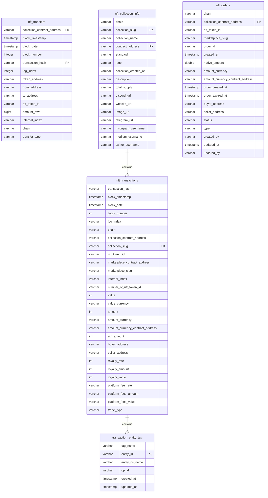

## Data Overview 


### Data Relationship



## NFT Analysis Scenarios

In footprint analytics , we index about 20 NFT marketplace, including opensea, rarible, foundation, blur, element, superrare, magic-eden, the-sandbox, aavegotchi, cryptopunks, etc.
We use collection_slug as a unique identifier for each NFT collection, and using marketplace_slug as a unique identifier for each NFT marketplace.
collection_slug to name some blue chip nft collection, such as cryptopunks, crypto-kitties, art-blocks, bored-ape-yacht-club, mocaverse , etc.


### query NFT marketplace Total Volume of using X2Y2  

```sql
SELECT date("footprint"."nft_transactions"."block_timestamp") AS "block_timestamp", sum("footprint"."nft_transactions"."amount") AS "sum"
FROM "footprint"."nft_transactions"
WHERE lower("footprint"."nft_transactions"."marketplace_slug") = 'x2y2'
GROUP BY date("footprint"."nft_transactions"."block_timestamp")
ORDER BY date("footprint"."nft_transactions"."block_timestamp") ASC
```
### Query 0x022308cfb134b955f455cdabf259d9b0bcf26210 the number of pending orders and the maximum pending order price in the last 7 days on the opensea
```sql
SELECT 
count(1) as listing_nums,
max(amount) as "ETH Amount"
FROM "nft_orders"
where marketplace_slug ='opensea'
and collection_contract_address ='0x022308cfb134b955f455cdabf259d9b0bcf26210'
and created_at >= date_add('day',-7,current_date)
and type = 'listing'
and amount_currency ='ETH'
```
### query NFT marketplace Total trade count of using X2Y2  

```sql
SELECT date("footprint"."nft_transactions"."block_timestamp") AS "block_timestamp", count(*) AS "count"
FROM "footprint"."nft_transactions"
WHERE lower("footprint"."nft_transactions"."marketplace_slug") = 'x2y2'
GROUP BY date("footprint"."nft_transactions"."block_timestamp")
ORDER BY date("footprint"."nft_transactions"."block_timestamp") ASC
```

### query NFT marketplace Daily Active User of using X2Y2  

```sql
with buyer_ad as(
SELECT 
seller_address  as  address,
date("nft_transactions"."block_timestamp") as date
FROM "nft_transactions"
where lower("marketplace_slug") = 'x2y2'
group by 1,2
),
seller_ad as (
SELECT 
buyer_address as address,
date("nft_transactions"."block_timestamp") as date
FROM "nft_transactions"
where lower("marketplace_slug") = 'x2y2'
group by 1,2
)
select count(distinct address) as address
from 
(
select * FROM
    buyer_ad
    union all 
 select * FROM
    seller_ad
)as a
```

###  washtrade analysis

Wash trading is the act of a trader buying and selling the same asset repeatedly to manipulate the trading volumes and/or the price of an asset. Parties involved may consist of a single entity or a collusion of entities. It is illegal in traditional capital markets to wash trade, as the intent is often to mislead other buyers/sellers that the asset is worth a lot more than it is, and/or that there is an artificially liquid market for the asset.
for more : https://coinmarketcap.com/community/articles/638ff563994fd743936035d7/ 


####  get NFT Washtrade Value Share by Marketplace

```sql
SELECT "footprint"."nft_transactions"."marketplace_slug" AS "marketplace_slug", sum("footprint"."nft_transactions"."value") AS "sum"
FROM "footprint"."nft_transactions" INNER JOIN "footprint"."transaction_entity_tag" "Transaction Entity Tag" ON "footprint"."nft_transactions"."transaction_hash" = "Transaction Entity Tag"."entity_id"
GROUP BY "footprint"."nft_transactions"."marketplace_slug"
ORDER BY "sum" DESC, "footprint"."nft_transactions"."marketplace_slug" ASC
LIMIT 2000
```

#### query NFT Key Stats by Chain , including Washtrade

```sql
with buyers as(
    SELECT 
        chain,
        buyer_address as address
    FROM "footprint"."nft_transactions"
    GROUP BY 1
    ,2
)
,sellers as (
    SELECT 
        chain,
        seller_address as address
    FROM "footprint"."nft_transactions"
        GROUP BY 1
        ,2
),
total_users as (
 select
       count(distinct address) as total_tradersk,
       chain
  from 
        (
        select * from buyers
        union all 
        select * from sellers
        )a 
        GROUP by 2

)
,stats as (
    select 
        chain,
        sum(value) as total_sales_value,
        sum(case when entity_id is  null then 0 else value end)/sum(value) as washtrade_value_ratio,
        count(distinct buyer_address) / cast(count (distinct seller_address) as double) as "buyer/seller ratio",
        count(distinct seller_address) as sellers,
        count(distinct buyer_address)as buyers,
        count(distinct collection_slug) as total_collections
    from nft_transactions
    left join transaction_entity_tag
    on nft_transactions.transaction_hash = transaction_entity_tag.entity_id
    group by 1
    order by 2 desc 
)
  
select 
stats.chain,total_sales_value
,washtrade_value_ratio
,buyers 
,sellers
,"buyer/seller ratio"
,total_collections
from 
total_users
inner join 
stats
on total_users.chain = total_users.chain
group by 1,2,3,4,5,6,7
order by total_sales_value desc
```

### NFT collection analysis

####  get Total Mints of Mocaverse

```sql
SELECT sum("footprint"."nft_transfers"."amount_raw") AS "sum"
FROM "footprint"."nft_transfers"
LEFT JOIN "footprint"."nft_collection_info" "nft_collection_info" ON ("footprint"."nft_transfers"."collection_contract_address" = "nft_collection_info"."contract_address"
   AND "footprint"."nft_transfers"."chain" = "nft_collection_info"."chain")
WHERE  "footprint"."nft_transfers"."transfer_type" = 'mint' AND "footprint"."nft_transfers"."collection_contract_address" = '0x59325733eb952a92e069c87f0a6168b29e80627f'  

```


#### Top 10 Ethereum NFT Projects Transactions 

```sql
select c.collection_name,
count(*) as transaction_count
from nft_transactions t
inner join nft_collection_info c on t.collection_contract_address = c.contract_address
where t.block_timestamp >= date_parse('2022-01-01', '%Y-%m-%d')
    and t.chain = 'Ethereum'
group by 1 
order by 2 desc
limit 10
```

#### To query nft holders, you need to take the nft_transfers table and transfer in and out of the corresponding collection according to each user. When the number of transfers minus the number of transfers is greater than 0, the user is considered to hold the nft of this collection, such as the following cryptopunks The holding user example
```sql
select 
    count(1) as holders
from 
(
select 
address,
sum(nfts) nfts
from 
(SELECT 
    to_address as address,
    sum(amount_raw) as nfts
    FROM "footprint"."nft_transfers"
WHERE 1=1
and collection_contract_address = lower('0xb47e3cd837ddf8e4c57f05d70ab865de6e193bbb')  -- 0xb47e3cd837ddf8e4c57f05d70ab865de6e193bbb  cryptopunks collection address
group by 1
union all 
SELECT 
    from_address as address,
    -sum(amount_raw) as nfts
    FROM "footprint"."nft_transfers"
WHERE 1=1
and collection_contract_address = lower('0xb47e3cd837ddf8e4c57f05d70ab865de6e193bbb')
group by 1
)a
group by 1
order by  2 desc
)
where nfts >0
```

