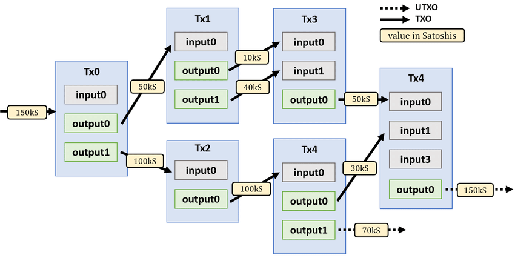
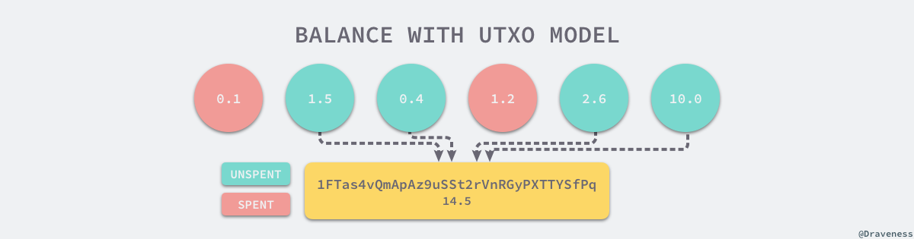
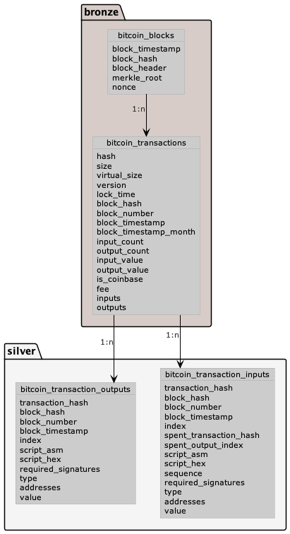
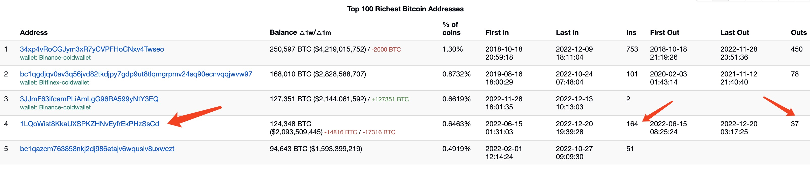

## Bitcoin Data Model

### UTXO Account Model

UTXO is different from the mainstream blockchain account model which is now used by most block chain projects. Bitcoin, the first blockchain cash system to emerge, uses the UTXO model as the data structure for its underlying storage, full Name as ***Unspent Transaction output***。

Each bitcoin transaction consists of **input** and **output**, where the input contains the data amount of the transaction and the address, and the output contains the output amount of the transaction and the output address. During a bitcoin transaction, the input of each transaction is the output of the previous transaction, and the output of each transaction can also be the input of subsequent transactions.

Because each bitcoin transaction is based on the output of a previous transaction, a new transaction can only be made before the input is spent. This avoids reusing bitcoins and ensures that transactions are **secure**.



### Transaction content

In a transaction, each input and output of the transaction is recorded, similar to what is recorded in double-entry bookkeeping：


The above double-entry bookkeeping can be understood as a transaction in Bitcoin, the left side shows the input of this transaction, putting in bitcoins from 4 addresses, and the right side shows the output of this transaction.This transaction is output to three addresses with a total input amount of 0.55 and a total output amount of 0.5, with the difference being the miner's revenue.

Therefore, in the same transaction, this equation must be satisfied：

```javascript
Total Input - Total Output = Miner Fee
```

### Balance calculation

All transactions are stored on the blockchain through the UTXO account model, and the **balance** in an address is not recorded on a block, but is **composed of all UTXOs** related to that address in the blockchain network.

With the above double-entry bookkeeping operation, if you want to calculate the balance of a certain address, you need to calculate the amount not spent by the address in multiple double-entry books, you can derive the equation

```javascript
Balance = Total Input - Total Output
```



### Related BlockChain

The UTXO model is the transaction model used in Bitcoin and many other blockchain ecosystem. Here are some blockchains that use the UTXO model, the data structure of these blockchains, and the way the calculations are kept consistent. The queries we used in the article are able to be applied to these blockchain data：

- [Bitcoin](https://bitcoin.org/en/) (BTC)
- [Bitcoin Cash](https://bitcoincash.org/) (BCH)
- [Litecoin](https://litecoin.org/) (LTC)
- [Gogecoin](https://dogecoin.com/) (DOGE)

## Data Structure

### Overview

Blockchain data has the data structure of a blockchain, but is less friendly for analysis. Therefore, we need to transform the blockchain data into a relational database to analyze. Footprint has taken care of the hard stuff for users. When blockchain data is converted into a relational database, Bitcoin data consists of Blocks, Transactions. The relationship as shown below：



The tables **bitcoin_transaction_inputs** and **bitcoin_transaction_outputs** are derived from **[Footprint (subsequently FP)](https://www.footprint.network/)** to facilitate the calculation of the UTXO model. Through the above diagram we can observe the following characteristics of their relationship：

- One block contains multiple transactions，**association via block_hash**
- One chain's transaction contains multiple inputs transaction and outputs transaction，**association via transaction_hash**

## UTXO computational extrapolation

Next, let's try to extrapolate the process of calculating the balance of UTXO using the FP analytics. This calculation process provides a clearer picture of the entire UTXO data structure，to perform calculations of custom metrics using bitcoin **Bronze** level data provided by FP.

By browsing [Bitcoin Rich List](https://bitinfocharts.com/top-100-richest-bitcoin-addresses.html) , We found some of the richest bitcoin wallets. Let's take this fourth ranked (stats on 2022/12/22) address:**1LQoWist8KkaUXSPKZHNvEyfrEkPHzSsCd** as an example. We know some information about this address from the website：

- Inputs: **37**
- Outputs: **164** 
- First transaction time：**2022-06-15 08:25:24**
- Current Balance： **124348 BTC**

We used the FP analytics to try to query these data, to verify that the data in the blockchain is consistent with the results given on the Rich List.



### Input/output list

> Through the **bitcoin_transaction_inputs** table provided by FP, Execute the following SQL

```sql
select
	array_join(inputs.addresses,',') as address,
	inputs.type,
	-inputs.value as value,
	block_timestamp
from
	bitcoin_transaction_inputs as inputs
WHERE
	CONTAINS(addresses,'1LQoWist8KkaUXSPKZHNvEyfrEkPHzSsCd') and block_timestamp > timestamp '2022-06-13';
```

Query Results：

- Total number of rows of transaction output： 37 

⚠️ Attention：

- The **bitcoin_transaction_inputs** table contains the address related records of the **inputs action**, Since it is a **inputs action**, the money in the wallet will naturally flow to **outputs**, So to calculate how many **outputs** there are, you need to use the **inputs** table. And vice versa, calculate as many **inputs** as you need to use the **outputs** table.
- The purpose of using **block_timestamp** filtering here is to improve the efficiency of the query, When the block time of the first transaction is known to be on **2022-06-13**, It is possible to filter the data in time to improve the efficiency of the query.

### Total input/output amount

> By executing the following SQL on the FP's SQL interface, summary of inputs records associated with this address. get the **total output amount** for the address, the **outputs** same as that.

```sql
select
	array_join(inputs.addresses,',') as address,
	inputs.type,
	SUM(-inputs.value) as value
from
	iceberg.footprint.bitcoin_transaction_inputs as inputs
WHERE
	CONTAINS(addresses,'1LQoWist8KkaUXSPKZHNvEyfrEkPHzSsCd') and block_timestamp > timestamp '2022-06-13' group by 1,2;
```

Calculation results：

- Total input amount：21016587227364
- Total output amount：-8581746649469

### Unspent Transaction Amount (UTXO) & balance

> According to the equation raised above，The transaction unoutput amount (UTXO) is equal to the total input minus the total output, Calculate the balance **124348 BTC** consistent with data from **Rich List**. At this point, we have verified the authenticity of the address balance through the FP on chain data.

```javascript
(21016587227364 - 8581746649469) / 10e7 = 124348.40577895
```

Remarks：

- Because **1 BTC = 100000000 satoshi**, the data on chain is calculated in satoshi, so it needs to be converted after getting the results.

## Application Scenarios

- The data tables provided by FP allow for more in-depth exploration, such as some of the following scenarios：
  - Calculate the miner's fee generated by each transaction
  - Calculating the World's Richest Bitcoin Wallet
  - Calculate how many addresses is Diamond hands (Addresses where no inputs have occurred for a long time)
- In combination with the **alerts** function provided by **FP**, monitoring of some big whale wallets is possible, monitor wallet inputs and outputs behavior, through timely access to dynamic data on blockchain to make better investment decisions.

## References

- [UTXO Account Models](https://draveness.me/utxo-account-models/)
- [Description of Bitcoin Blocks and Transactions](https://marcsteiner-consulting.ch/description-of-bitcoin-blocks-and-transactions)
- [An example of UTXO-based transfers in Bitcoin](https://www.researchgate.net/figure/An-example-of-UTXO-based-transfers-in-Bitcoin_fig6_334434726)


