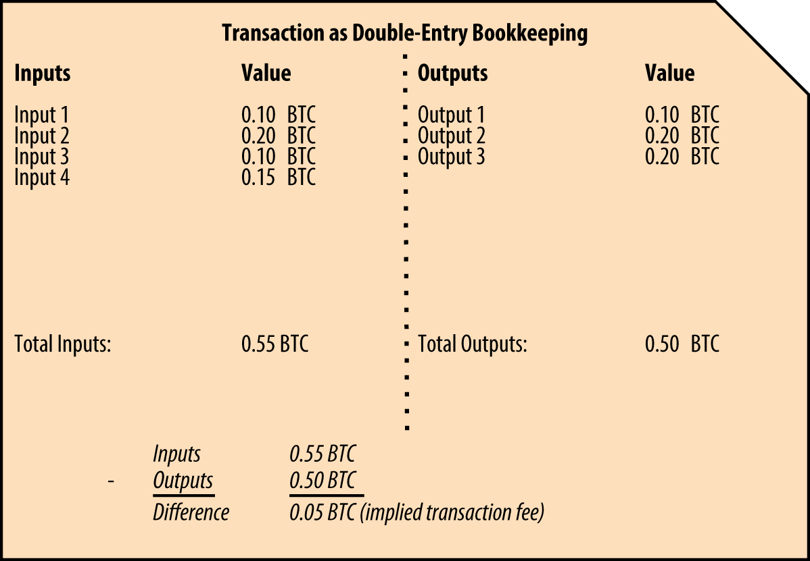
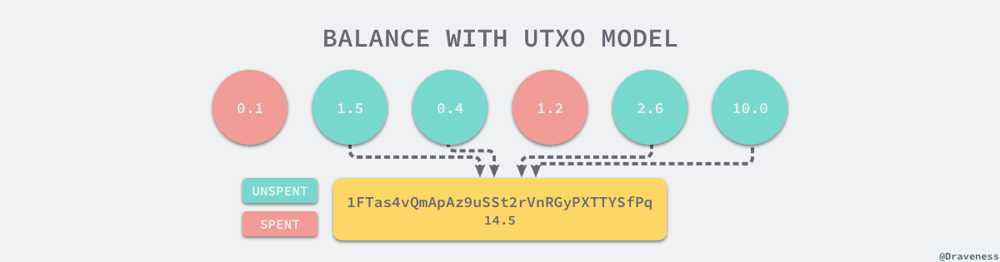
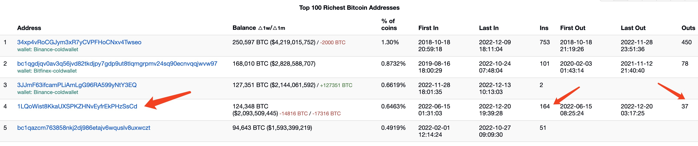

## 比特币数据模型

### UTXO 账户模型

不同于现在主流的区块链账户模型，现在的公链项目大部分都是使用账户模型，但比特币不同。Bitcoin 作为第一个出现的区块链现金系统，采用了 UTXO 模型作为其底层存储的数据结构，全称为 ***Unspent Transaction output***，也就是**未被使用的交易输出**。

每一笔比特币交易都由**输入**和**输出**组成，其中输入包含交易的数据金额以及地址，输出包含交易的输出金额以及输出地址。在比特币交易过程中，每一笔交易的输入都是来自先前的交易的输出，并且每一笔交易的输出也可以成为后续交易的输入。

因为每一笔比特币交易都是基于先前的交易输出，所以只有在输入被花费之前，才能进行新的交易。这样可以避免重复使用比特币，保证交易的**安全性**。


### 交易内容

在一笔交易里面，记录了交易里每一笔输入跟输出，类似于复式记账法所记录的内容：



上面的复式记账法可以理解为比特币中的一笔交易，左侧可以理解为这笔交易的输入，从 4 个地址把比特币进行输入，右侧可以理解为该笔交易的输出，这笔交易输出到三个地址上，输入总金额为 0.55，输出总金额为 0.5，差异部分为矿工的收入。

因此在同一笔交易里，必定满足这样的一个等式：

```javascript
总交易输入 - 总交易输出 = 交易费
```

### 余额计算

所有的交易都是通过 UTXO 账户模型的交易保存在区块链上，某一个"账户"中的**余额**并不是记录在某个区块上的，而是由当前区块链网络中所有跟该账户**有关的 UTXO 组成**的。通过以上复式记账的运算，如果要计算某个地址的余额，需要计算在多个复式记账的账本中，用户未花费的金额，可以得出等式：

```javascript
地址余额 = 地址总输入 - 地址总输出
```



### 相关币种

UTXO 模型是比特币和许多其他区块链系统中使用的交易模型。以下是一些使用 UTXO 模型的链，这些区块链的数据结构，以及计算方式基本保持一致，我们在文章中使用到的查询，都能够套用在这些区块链的数据上：

- [比特币](https://bitcoin.org/en/) (BTC)
- [比特现金](https://bitcoincash.org/) (BCH)
- [莱特币](https://litecoin.org/) (LTC)
- [狗狗币](https://dogecoin.com/) (DOGE)

## 数据结构

### 概览

区块链的数据有区块链的数据结构，但是对于分析来说不太友好，因此，我们需要把区块链数据转化成关系型数据库来分析，转化后，数据的关系分为 Blocks，Transactions 组成。关系如下：


其中 **bitcoin_transaction_inputs**，**bitcoin_transaction_outputs** 这两张表是在 **[Footprint（后续简称 FP）](https://www.footprint.network/)** 中为了可以方便进行 UTXO 模型的计算而衍生出来的数据表，通过上图我们可以观察到他们之间的关系有以下的特点：

- 一个区块包含了多笔交易，**通过 block_hash 进行关联**
- 在同一笔交易内，有多笔交易输入输出，**通过 transaction_hash 进行关联**

## UTXO 计算推演

接下来我们来尝试一下使用 FP 数据分析工具来推演一下 UTXO 计算余额的过程，在过程中可以更加清晰地了解整个 UTXO 的数据结构，以便使用 FP 提供的比特币 **Bronze** 级别的数据进行其他指标的计算。

通过 [Bitcoin Rich List](https://bitinfocharts.com/top-100-richest-bitcoin-addresses.html) 我们找到一个最有钱的比特币钱包，我们以这个排名第四（统计于 2022/12/22）的地址：**1LQoWist8KkaUXSPKZHNvEyfrEkPHzSsCd** 为例子，进行数据分析，通过网站查询的信息我们得知此地址的一些信息：

- inputs： 37 笔
- outputs： 164 笔
- 首次交易：2022-06-15 08:25:24
- 余额： 124348 BTC

我们使用 FP 分析工具来尝试获取这些数据，以验证整个链上的数据是否与 Rich List 上给出的结果保持一致。



### 输入/输出列表

> 通过 **FP 提供的 bitcoin_transaction_inputs** 表，执行以下 SQL

```sql
SELECT array_join(inputs.addresses, ',') AS address, 
       inputs.type, 
       -inputs.value AS value, 
       block_timestamp
FROM bitcoin_transaction_inputs AS inputs
WHERE CONTAINS(addresses, '1LQoWist8KkaUXSPKZHNvEyfrEkPHzSsCd')
  AND block_timestamp > timestamp '2022-06-13';
```

计算结果：

- 总输出： 37 笔

⚠️ 注意：

- bitcoin_transaction_inputs 表意指**执行了 inputs 行为的地址相关记录**，钱包执行了 inputs 动作，那钱包的的钱自然就会流向 outputs，因此如要计算有多少 **outputs** 就需要使用 **inputs** 表，反之亦然，计算多少 **inputs** 就要使用 **outputs** 表。
- 这里做 **block_timestamp** 过滤目的是为了提高查询的效率，当知道首次交易的区块时间是在 **2022-06-13** ，就可以对数据进行时间筛选以提高查询效率。

### 输入/输出总金额

> 通过对在 FP 的 SQL 界面执行以下 SQL, 对该地址相关的 inputs 记录进行汇总，获取到该地址总输出金额，outputs 同理

```sql
select
	array_join(inputs.addresses,',') as address,
	inputs.type,
	SUM(-inputs.value) as value
from
	iceberg.footprint.bitcoin_transaction_inputs as inputs
WHERE
	CONTAINS(addresses,'1LQoWist8KkaUXSPKZHNvEyfrEkPHzSsCd') and block_timestamp > timestamp '2022-06-13' group by 1,2;
```

计算结果：

- 总输入：21016587227364
- 总输出：-8581746649469

### 交易未输出(UTXO)/余额

> 根据上面提高的公式，交易未输出金额（UTXO）等于总输入减去总输出，得到余额 **124348 BTC** 与 **Rich List** 的数据保持一致，至此，我们已通过链上数据验证了该地址余额的真实性。

```javascript
(21016587227364 - 8581746649469) / 10e7 = 124348.40577895
```

备注：

- 因为 **1 BTC = 100000000 satoshi**，而比特币链上的数据是以 satoshi 为计算单位，因此得到数据后需要进行转换

## 应用场景

- 通过 FP 提供的数据表，可以进行更深入的探索，例如以下的一些场景：
  - 计算每一笔收益所产生的矿工手续费
  - 计算世界上最有钱的比特币钱包
  - 计算多少地址属于长期 holder（长期没有发生 inputs 行为的地址）
- 同时结合 **FP** 提供的 **alerts** 功能，可以对一些大鲸钱包进行监控，监控钱包 inputs 以及 outputs 行为，获取第一手的链上动态，以便做出更好的投资决策。

## 相关资料

- [UTXO 与账户余额模型 - 面向信仰编程 (draveness.me)](https://draveness.me/utxo-account-models/)
- [Description of Bitcoin Blocks and Transactions](https://marcsteiner-consulting.ch/description-of-bitcoin-blocks-and-transactions)
- [An example of UTXO-based transfers in Bitcoin](https://www.researchgate.net/figure/An-example-of-UTXO-based-transfers-in-Bitcoin_fig6_334434726)


