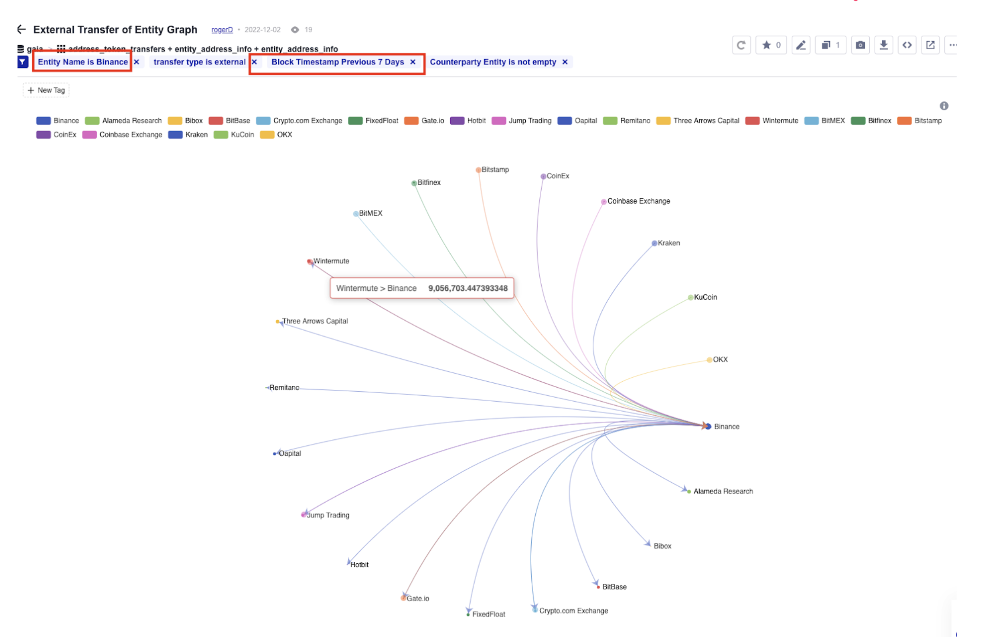

## Address Data Concept

### Data Concept

- 以太坊上的地址主要分为两种，一种是钱包地址，一种是合约地址

- 相同之处
    - 数据内容一致，都是40个十六进制字符组成的字符串，同时都具备价值存储，价值转移等功能

- 不同之处
    - 交易只能由钱包地址发起
    - 合约地址被动执行
    - 合约是多种功能实现的桥梁，例如 dapp 的各种业务都是通过合约来实现
    - 合约是各种价值存储载体，例如 token , nft 等等

通过了解两种地址的相同与不同，我们看看他们对应的结构是怎样的构成，同时了解通过一些分析场景来了解这些数据是如何应用的？我们先看看 wallet address 的情况，再来了解 contract address 以及它的各种实现的分析。

### Contract 表现形式

- 在区块链上，合约有多种具体表现形式，例如 erc20 token,  nft 或者是一个协议 （protocol ) 的功能性合约

## Wallet Address

### 分析纬度

wallet address 我们提供了以下的这些常用的分析：

- Balance
    - 通过分析地址持有的热门 token ,知道当前钱包的总价值，可以用来追踪一些大鲸在链上的资金变动情况
- Portfolio
    - 通过对 address 的组合，分析一个 portfolio 的资产情况，这个 portfolio 可以是个人的投资组合，也可以是实体公司的链上资产组合，例如 CEX , 通过 portfolio 的汇总，可以知道像币安这样的交易所资产的变化情况以及异动。
- Tags
    - 标签是一种常用的分析场景，链上的地址只是一串数字，需要结合链下的数据对地址赋予意义更加有助于分析地址的情况。同时上面提到的大鲸，CEX 这些都是通过标签归纳得出的数据，从链上是无法直接获取这样的数据。

### 分析场景

- 资金流分析

