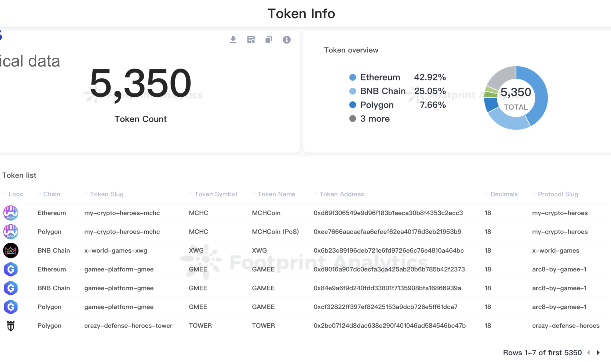
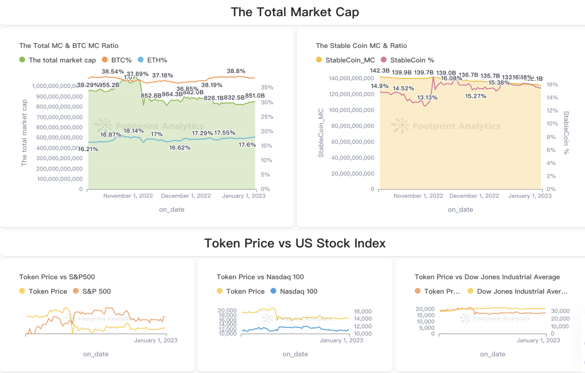

## Token

链上的 token 的数量巨大，任何有开发经验的人都可以发行一个 ERC-20 的代币，但是真实活跃的 token 数量其实不多。因此，我们收录了接近 6000 个 token 的基础信息，收录的重点是币价和协议相关的数据.

### 币价数据

- 准确性如何保证，综合币价源，系统通过 chainlink，dex , cmc , coingecko 等渠道收录的币价源，检测币种的情况，方便做出选择，有时候在某个 dex 出现币价波动大的情况是很正常的，特别是小币种，这些数据来源都各有优缺点，我们从开发者的角度可以谈谈这部份的数据，供有需要用到的同学参考.

### 币价数据来源对比

| 渠道          | 优点                       | 缺点                      |
|--------------------------|-------------------------| ------------------------------------------------------------ |
| Chainlink     | 数据准确性高                   | 覆盖币种数少                  |
| DEX           | 覆盖币种数全  收录及时         | 单一DEX数据波动大        |
| CMC/Coingecko | 综合 DEX/CEX 币价 数据相对准确 | 收录币种有准入门槛  依赖平台 API |

### 协议关联数据

- token 跟 protocol 的关联在分析 protocol 的综合表现的情况下也是挺有用，举个例子我们要分析 [Axie Infinity](https://axieinfinity.com/) 这个游戏在链上的发展情况，就需要看他的两个代币 [AXS](https://etherscan.io/token/0xbb0e17ef65f82ab018d8edd776e8dd940327b28b) 和 [SLP](https://etherscan.io/token/0xcc8fa225d80b9c7d42f96e9570156c65d6caaa25) 在链上的表现情况，目前这部分关联的信息属于**链下数据**，一般通过用户标签或者收录的形式进入系统。

### Analysis Scenarios

- 获取 token 的数据之后可以做这样的一些分析场景，例如这个 dashboard，分析了比特币和以太坊的市值关联性，分析了加密行业与美股的关联性等.

