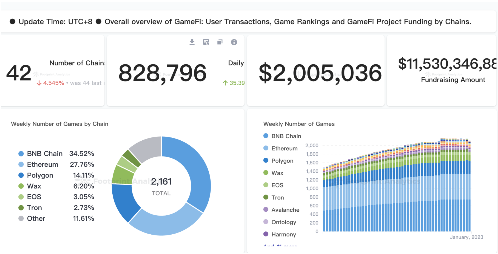

## Protocol

### 数据关系

- 以 contracts 为中心推断出 tvl , volume 等数据

### 分析纬度/场景

- tvl
- volume
- users
    - activity
    - new
    - retention

### 数据来源

> 重点了解 mapping 以及 tvl 的数据统计来源，其他部份都是可以通过标准化口径统计

- protocol contracts mapping
    - off chain  合作方
    - on chian 合约编码等数据
- tvl methodology
    - 开发者开源社区
    - 项目方 
