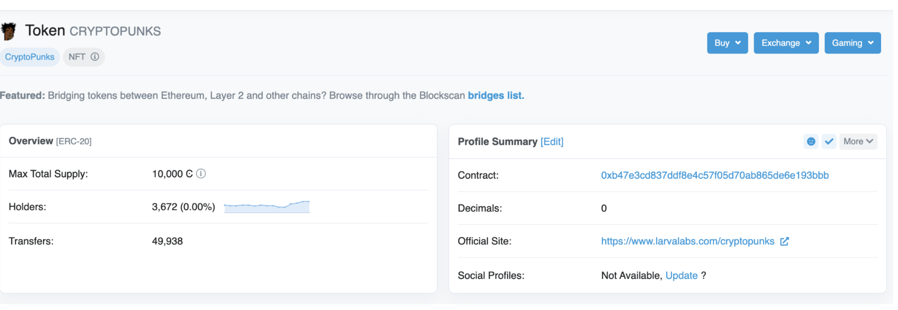
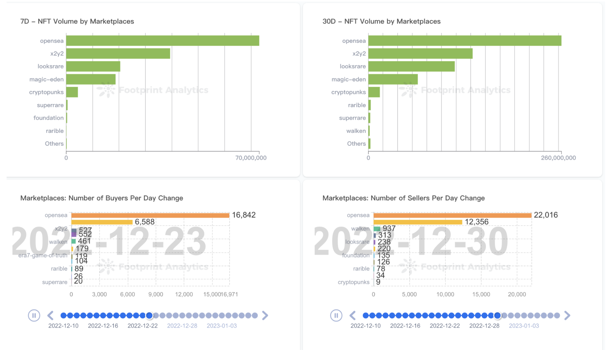

## 数据预览

### 基础数据

- 合约
- 发行量
- 名称/symbol

### 统计数据

- holders
- tansfers



## 统计口径

- total_minted : 历史总 minted 的数量
- total_supply : NFT 当前流通量，即历史总 minted 的数量 - 历史总 burned 的数量
- max_supply : NFT发行总量，不随着时间或者 mint /burn 行为发生变化

## 数据关系

> 结合数据关系图展示 NFT 的数据关系

- NFT id is unique within the contract
    - 唯一性，标准化的实现，大部份的情况下都是这样实现一个 NFT
- Collection is a contract
    - 因此我们收录 collection 的来源也是 contracts，只要发现链上 contracts 是属于 NFT 标准，即是 collection. **nft_colleciton_info** 表就是通过 detect 链上合约数据而来.
- One collection has multiple NFTs
    - 一个 collection 一般情况下会发行多个 NFT， 例如刚才展示的数据概览，CryptoPunk 发行了 10000 个 NFT.
- One NFT has multiple attributes
    - 一个 NFT 一般会有多个属性，例如黑头发，黄皮肤等就属于一个 Punk 的属性.
- One NFT can be listed on more than one marketplace
    - 一个 NFT 可以在多个 NFT 交易市场上进行展示或交易，因此可以看到很多 NFT colleciton 的交易都是分布在不同的交易市场，而且通过链上数据还会发现不同的交易市场会存在一定加差，很多机器人利用信息差赚钱.

## 分析场景

### 行业概况

- 分析各个交易市场当前的 volume 以及历史变化情况，看到 NFT 行业的概况



## 常见统计

### 查询 top collection 里面发生过 burned 的数据

```sql
WITH list AS
  (SELECT n.collection_slug,
          n1.contract_address
   FROM iceberg.prod_silver.nft_collection_list AS n
   LEFT JOIN iceberg.prod_silver.nft_collection_info n1 ON n.collection_slug = n1.collection_slug
   WHERE n.list = 'top_collection'
     AND n.status = 'prod' )
SELECT *
FROM iceberg.footprint.nft_transfers
WHERE collection_contract_address in
    (SELECT contract_address
     FROM list)
  AND from_address = '0x0000000000000000000000000000000000000000'
LIMIT 10
```

### 计算 NFT 流通量 

> 注意需要知道合约的创建时间用于做过滤，不然没有击中索引速度会很慢

```sql
WITH total_minted AS
  (SELECT count(*) AS minted_count
   FROM iceberg.footprint.nft_transfers
   WHERE collection_contract_address = '0x59325733eb952a92e069c87f0a6168b29e80627f'
     AND from_address = '0x0000000000000000000000000000000000000000'
     AND block_timestamp > timestamp '2023-03-01' ),
     total_burned AS
  (SELECT count(*) AS burned_count
   FROM iceberg.footprint.nft_transfers
   WHERE collection_contract_address = '0x59325733eb952a92e069c87f0a6168b29e80627f'
     AND to_address = '0x0000000000000000000000000000000000000000'
     AND block_timestamp > timestamp '2023-03-01' )
SELECT minted_count AS minted_count,
       burned_count AS burned_count,
       minted_count - burned_count AS total_supply
FROM total_minted,
     total_burned;
```

