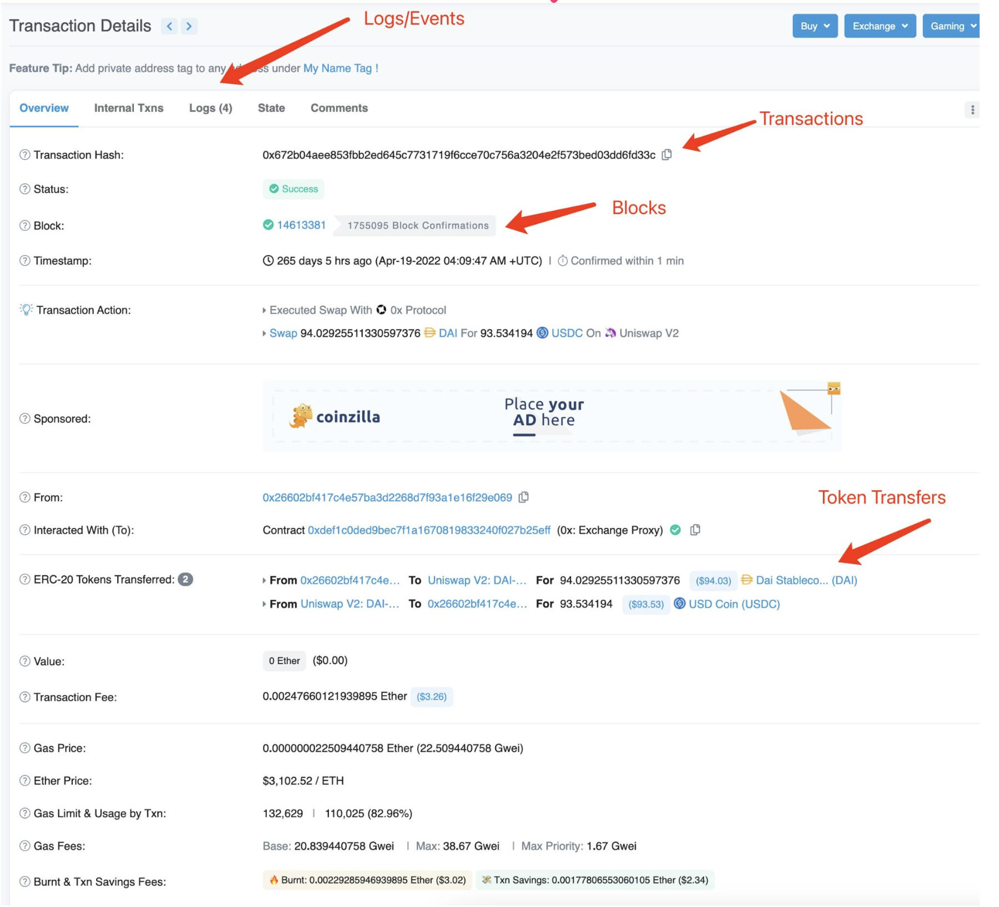
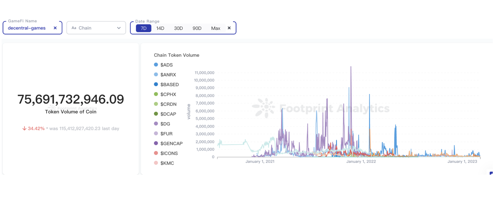

# EVM Data Analytics

## 个人介绍/内容介绍

> 个人目前在职于 Footprint Analytics 从事区块链数据分析相关工作，致力于**研究和分析区块链技术及其应用的数据**。

> 主要工作内容是研究**链上数据的特征**，通过大数据分析的工具，组织链上数据的结构，包括**比特币、以太坊、智能合约、去中心化应用、NFT** 等领域，从而为客户提供精准、可靠的数据分析报告和洞察。

> 开始这个话题想问问大家在研究项目的时候是否有做数据分析，有请回复1，没有请回复0，我了解一下大家对数据的关注程度。例如最近 ARB 空投这个事情，你知道空投的白名单是什么出来的么？答案是链上数据，因为整个区块链的数据是透明的，Arbitrum  通过分析链上的行为，筛选出为这个生态做过贡献的用户，并给他们发放奖励。我们也可以通过链上的数据分析，发现投资的价值，或者判断项目的真伪，做出合理的决策。

> 今天主要是讲讲我们平时常见领域的数据是怎么进行分析的，课程不会讲得很深入，目的是带着大家一起了解一下这些**数据结构，产生原理，分析场景等**，以便大家在分析的时候可以快速应用起来。

## Footprint 介绍

- Footprint Analytics 是一个链上数据分析工具，覆盖**24条公链，17个Marketplace，包括EVM和非EVM兼容链**.
- Footprint 提供可视化工具和数据表来发掘和可视化整个区块链的数据，例如NFT和GameFi的数据表.
- Footprint 数据表**抽象了业务逻辑**，提供了用户数、Volume等指标，可以轻松进行**跨链分析**，极大提高了用户使用数据的效率.

## Data Overview 

### 链上数据结构

#### 链式结构

> 链式结构不方便进行数据分析

区块链上的数据是以链式结构保存的，每个区块保存了一部分交易数据，并链接到前一个区块，形成一个不可篡改的链条。这种结构对于区块链的安全和可信性非常重要，但也带来了数据分析上的挑战，因为数据是分**布在多个区块中的，而且每个区块的大小有限制**。这使得数据的分析和处理变得非常困难，需要针对链式结构进行特殊的处理和分析。

#### 单一索引

> 只有 block hash，transactions hash 等索引，无法进行多维度的分析

在区块链上，每个区块、每笔交易都有唯一的标识符，例如区块的hash值、交易的hash值等，这些标识符通常是单一索引，无法提供多维度的数据分析。例如，**如果想要分析某个地址的所有交易数据，需要遍历所有的交易记录，并逐一进行匹配，非常耗时且效率低下**.

#### 批量获取困难

> 需要大规模的机器集群获取并处理数据，普通分析师进入门槛高

区块链上数据安全性是重要考虑的，分析不是，因此数据获取只能部署链节点，通过对外的接口获取数据源，而这种获取数据的方式是低效的，一次性只能获取部分数据进行分析，而看不清整个数据的全貌，同时部署的机器成本是高昂的，解析的成本高昂。

## Chain Data

### **EVM Data Provided by Footprint** 

#### Relational Databases 

- 通过部署大规模的机器节点，我们获取链上数据后解析成**关系型数据库**结构，可以使用传统大数据分析工具轻易访问.

#### Provides on chain raw data 

- 例如结构图中是我们对链上的数据进行关系转换后的数据结构，有这样的一些特点：
  - blocks 包含多个 transactions 
  - 一笔 transactions 会产生多个 logs/events 
  - 一笔 transactions 会产生多个 token 的转移，即 token_transfers 
  - 链上的 logs 是加密后的数据，我们结合 **ABI (Application Binary Interface)** 解析出可视化的 events 数据

#### Provides silver layer data 

> Provides **silver** level data generated by combining **off chain** and **on chain** data 

- 光有链上数据分析还是有困难的，需要结合部分链下的数据进行分析，例如 protocol 跟 contracts 的关系，在关系图中 silver 级别的数据有部分需要链下提供，数据关系有这样的特点：
  - 一个 protocol 包含多个 contracts 
  - 一个 contracts 包含多个 events 

### **Data Mapping for Etherscan** 

- 通过常用的以太坊数据浏览器来解释一下数据表与区块链浏览器之间的关联关系.

{: w="700" h="400" }

### Transactions Analysis Scenarios

- 平均交易手续费
  - 我们通过分析 ethereum_transactions 上的数据，可以知道历史的交易手续费的情况，从图上我们观察到在 22 年 11 月份一段手续费飙高的情况。

- 手续费中位数
  - gas 费的平均数不代表普通用户的交易情况，用中位数更贴近用户的使用感受，因为链上很多交易机器人，会导致平均 gas 偏高或者偏低，观察这个**中位数**的统计，可以看到每一天不同时间段的交易情况，你可以选择你交易的时机，以便节省 gas 费。

- usd 单位手续费
  - 看 gas 费的同时，价格也是一个很重要的因素，因为价格反映你实际的支出，结合 **price 表** ，可以比较方便地计算实际的支出。

### Token Transfer Analysis Scenarios

- Token 交易 Volume 
  - 通过 token transfer ，我们知道每次 token 的转移数量，结合币价，我们可以分析每个 token 的交易情况。当然也可以计算其他指标，例如换手率，持有情况，长期持有者的数量等等。

